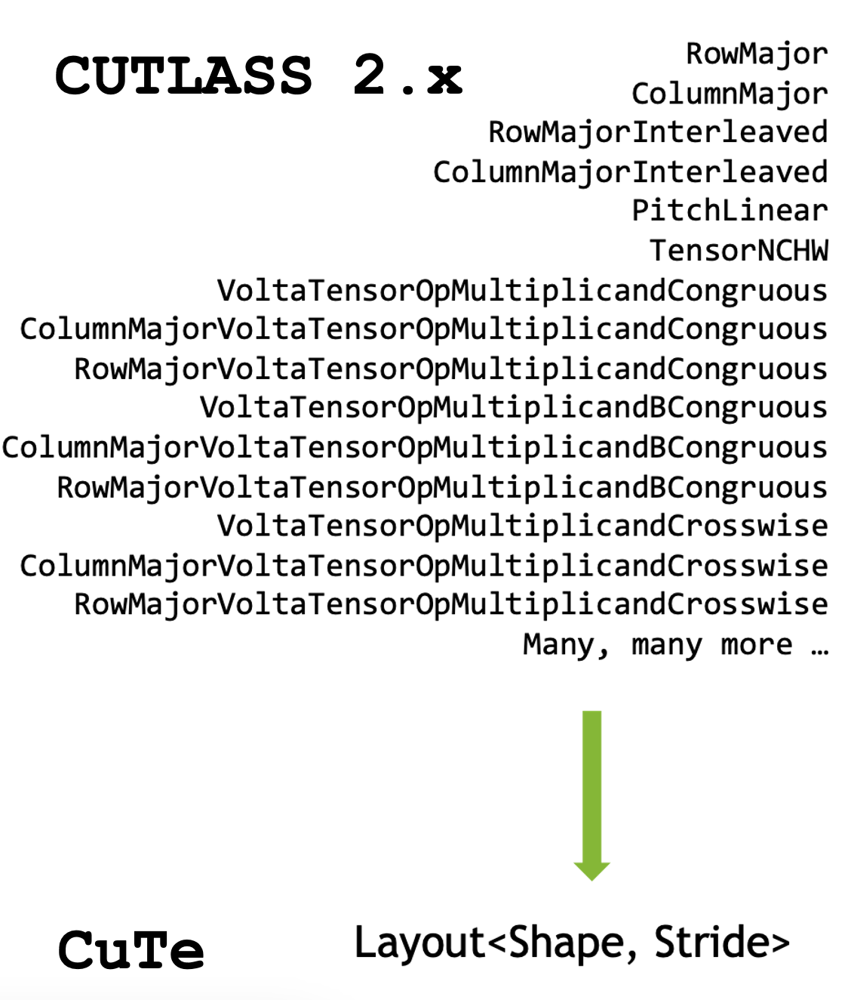

# cutlass 3.x

cutlass3.x 中将 cutlass2.x中关于layout，stride，迭代器等一套复杂的体系全部都适用 cute 的 layout进行处理

下面这张图就很形象地展示了这一点



cutlass 3.x的函数签名

```cpp
// 3.x 的 Arguments 构造：高度模块化、多维代数化
GemmUniversal::Arguments args{
    cutlass::gemm::GemmUniversalMode::kGemm, // 告诉它这是普通 GEMM 还是 Batched
    {M, N, K},                               // 问题规模 (ProblemShape)
    { // Mainloop 参数区 (管进)
        d_A, stride_A,                       // 注意：不再是 lda，而是 CuTe 的多维 Stride
        d_B, stride_B
    },
    { // Epilogue 参数区 (管出)
        {alpha, beta},                       // 算完后的操作参数
        d_C, stride_C,
        d_D, stride_D
    }
};
```