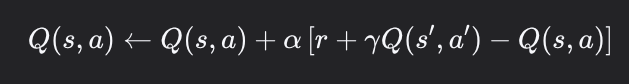

# 强化学习

强化学习是智能体与环境进行交互的过程，通过奖励函数来使得其对应决策能够获得的收益最大

## 基础概念

分为两个部分
- 智能体
- 环境

分为三个要素
- 状态
- 动作
- 奖励

## 策略


- 基于价值(value base)
  - Sarsa
  - Q-learning
  - DQN
- 基于策略(policy-base)
  - policy Gradient

一个使用gym的demo，可以分为三个部分
- 加载环境
- reset环境
- 处理环境反馈进行执行动作

```python3
import gymnasium as gym

# Create our training environment - a cart with a pole that needs balancing
env = gym.make("CartPole-v1", render_mode="human")

# Reset environment to start a new episode
observation, info = env.reset()
# observation: what the agent can "see" - cart position, velocity, pole angle, etc.
# info: extra debugging information (usually not needed for basic learning)

print(f"Starting observation: {observation}")
# Example output: [ 0.01234567 -0.00987654  0.02345678  0.01456789]
# [cart_position, cart_velocity, pole_angle, pole_angular_velocity]

episode_over = False
total_reward = 0

while not episode_over:
    # Choose an action: 0 = push cart left, 1 = push cart right
    action = env.action_space.sample()  # Random action for now - real agents will be smarter!

    # Take the action and see what happens
    observation, reward, terminated, truncated, info = env.step(action)

    # reward: +1 for each step the pole stays upright
    # terminated: True if pole falls too far (agent failed)
    # truncated: True if we hit the time limit (500 steps)

    total_reward += reward
    episode_over = terminated or truncated

print(f"Episode finished! Total reward: {total_reward}")
env.close()
```

## 表格型方法

### 1. Sarsa

Sarsa算法全称为"State-Action-Reward-State-Action"目的是学习特定的State下Ation的价值Q，最终建立和优化一个Q网格，以state为行，action为列，根据与环境交互的reward来更新Q表格

[Sarse 求解CliffWalking问题](./tabular/cliff_sarse.py)

由于sarsa算法会考虑到探索的风险，所以其有时会选择不到最优的路线，而是一个较优的路线，sarse的公式如下所示



```python3

class SarsaAgent:
    def __init__(self, obs_n, act_n, learning_rate=0.01, gamma=0.9, e_greedy=0.1):
        self.act_n = act_n
        self.lr = learning_rate
        self.gamma = gamma
        self.epsilon = e_greedy
        self.Q = np.zeros((obs_n, act_n))

    def sample(self, obs):
        if np.random.uniform(0, 1) < (1.0 - self.epsilon):
            action = self.predict(obs)
        else:
            action = np.random.choice(self.act_n)
        return action

    def predict(self, obs):
        Q_list = self.Q[obs, :]
        maxQ = np.max(Q_list)
        action_list = np.where(Q_list == maxQ)[0]
        action = np.random.choice(action_list)
        return action
    
    def learn(self, obs, action, reward, next_obs, next_action, done):
        predict_Q = self.Q[obs, action]
        if done:
            target_Q = reward
        else:
            target_Q = reward + self.gamma * self.Q[next_obs, next_action]
        self.Q[obs, action] += self.lr * (target_Q - predict_Q)

    def save(self):
        npy_file = './q_table.npy'
        np.save(npy_file, self.Q)
        print('save q_table to:', npy_file)
    
    def restore(self, npy_file='./q_table.npy'):
        self.Q = np.load(npy_file)
        print('restore q_table from:', npy_file)
```

### 2. Q-learning

Q-learning算法与Sarsa算法类似，但是其使用的是下一个状态的最优动作价值


```python3

class QLearningAgent:
    def __init__(self, obs_n, act_n, learning_rate=0.01, gamma=0.9, e_greedy=0.1):
        self.act_n = act_n
        self.lr = learning_rate
        self.gamma = gamma
        self.epsilon = e_greedy
        self.Q = np.zeros((obs_n, act_n))

    def sample(self, obs):
        if np.random.uniform(0, 1) < (1.0 - self.epsilon):
            action = self.predict(obs)
        else:
            action = np.random.choice(self.act_n)
        return action

    def predict(self, obs):
        Q_list = self.Q[obs, :]
        maxQ = np.max(Q_list)
        action_list = np.where(Q_list == maxQ)[0]
        action = np.random.choice(action_list)
        return action
    
    def learn(self, obs, action, reward, next_obs, next_action, done):
        predict_Q = self.Q[obs, action]
        if done:
            target_Q = reward
        else:
            target_Q = reward + self.gamma * np.max(self.Q[next_obs, :])
        self.Q[obs, action] += self.lr * (target_Q - predict_Q)

    def save(self):
        npy_file = './q_table.npy'
        np.save(npy_file, self.Q)
        print('save q_table to:', npy_file)
    
    def restore(self, npy_file='./q_table.npy'):
        self.Q = np.load(npy_file)
        print('restore q_table from:', npy_file)
```

sarse和qlearning对比而言，qlearning是off-policy算法，sarse是on-policy算法
Qleaning的更新目标是最优价值动作，而Sarsa的更新目标为当前动作价值，Qlearning可以学习到最佳但是可能危险的策略，而Sarse可以学习到更safer但是可能不是最优的策略

## 神经网络方法

