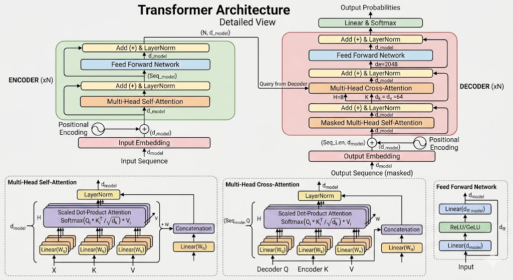

# LLM 架构组件

Transformer 架构由多个核心组件构成，本目录逐一拆解每个组件的原理与实现。



## 架构全景

```text
Token -> Embedding -> Position Encode -> [Attention -> Norm -> FFN -> Norm] × N -> Output
                                              |                    |
                                         Dropout              Dropout
                                              |                    |
                                         + ← ResAdd            + ← ResAdd
```

## 目录索引

| 组件 | 说明 |
| ---- | ---- |
| [tokenizer](./tokenizer/) | 分词器：BPE、WordPiece 等子词切分方法 |
| [position_encode](./position_encode/) | 位置编码：绝对位置编码（Sinusoidal）、相对位置编码（RoPE、ALiBi） |
| [Attention](./Attention/) | 注意力机制：Softmax、FlashAttention v1/v2/v4、FlashMLA、Ring Attention |
| [Norm](./Norm/) | 归一化层：BatchNorm、LayerNorm、RMSNorm、DeepNorm |
| [Linear](./Linear/) | 线性层与 MLP 设计：激活函数（GELU、SiLU/SwiGLU）、权重矩阵 |
| [dropout](./dropout/) | Dropout 正则化：原理、Transformer 中的使用位置、变体与现代趋势 |
| [MoE](./MoE/) | 混合专家模型：路由机制、Expert 均衡、DeepSeekMoE |
| [flow](./flow/) | 模型前向/反向计算流：训练与推理的完整数据流 |
| [sample](./sample/) | 采样策略：贪心、温度采样、Top-k、Top-p、Beam Search |
| [image.png](./image.png) | Transformer 架构全景图 |

## 各组件在 Transformer Block 中的位置

```text
  ┌─────────────────────────────────────────────┐
  │              Input Embeddings               │
  └─────────────────────┬───────────────────────┘
                        │
  ┌─────────────────────▼───────────────────────┐
  │           Position Encoding                 │
  └─────────────────────┬───────────────────────┘
                        │
  ┌─────────────────────▼───────────────────────┐
  │  ┌─────────────────────────────────────┐    │
  │  │         LayerNorm / RMSNorm         │ ◄─── Norm
  │  └─────────────────┬───────────────────┘    │
  │                    │                        │
  │  ┌─────────────────▼───────────────────┐    │
  │  │      Multi-Head Attention           │ ◄─── Attention + Attention Dropout
  │  └─────────────────┬───────────────────┘    │
  │                    │                        │
  │  ┌─────────────────▼───────────────────┐    │
  │  │        Dropout (Residual)           │ ◄─── dropout
  │  └─────────────────┬───────────────────┘    │
  │                    │                        │
  │            + ──────┘  (residual add)        │
  │            │                                │
  │  ┌─────────▼───────────────────────────┐    │
  │  │         LayerNorm / RMSNorm         │ ◄─── Norm
  │  └─────────────────┬───────────────────┘    │
  │                    │                        │
  │  ┌─────────────────▼───────────────────┐    │
  │  │           FFN / SwiGLU              │ ◄─── Linear + MoE
  │  └─────────────────┬───────────────────┘    │
  │                    │                        │
  │  ┌─────────────────▼───────────────────┐    │
  │  │        Dropout (Residual)           │ ◄─── dropout
  │  └─────────────────┬───────────────────┘    │
  │                    │                        │
  │            + ──────┘  (residual add)        │
  └──────────────────────┬──────────────────────┘
                         │
                   × N layers
                         │
  ┌──────────────────────▼──────────────────────┐
  │              Final LayerNorm                │
  └──────────────────────┬──────────────────────┘
                         │
  ┌──────────────────────▼──────────────────────┐
  │           Linear Head + Softmax             │
  └─────────────────────────────────────────────┘
```

## 学习路线建议

1. 先读 [tokenizer](./tokenizer/) 和 [position_encode](./position_encode/) 理解输入表达
2. 进入 [Attention](./Attention/) 理解 Transformer 的核心计算
3. 配合 [Norm](./Norm/) 和 [Linear](./Linear/) 理解完整的 Block 结构
4. 通过 [dropout](./dropout/) 了解训练时的正则化手段
5. 进阶阅读 [MoE](./MoE/) 和 [flow](./flow/) 了解大规模架构设计
