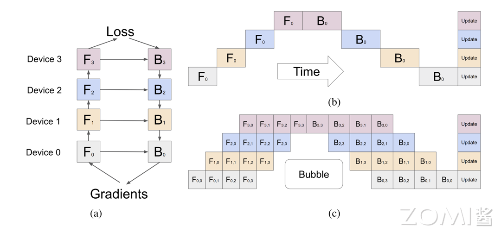

# 流水线并行

## 1.Gpipe

Gpipe 是一种用于加速神经网络模型训练的流水线并行技术，其将模型的计算任务分配到多个设备上，通过流水线化的方式使得模型的前向传播和反向传播可以重叠进行。

其思想类似CPU中的五段流水



在torch中我们可以使用 PipelineSchedule 去创建流水线,通过对模型进行手动或者自动的分割来实现流水线并行

针对于分布式的场景还可以使用 rpc 来进行数据的同步

## 2. PipeDream

PipeDream

## 3. 实现说明

### 核心概念

流水线并行的核心思想：

1. **模型分割（Model Partitioning）**：将模型按层切分到不同设备（Stage）
   - Stage 0: 接收原始输入
   - Stage i (0 < i < n-1): 接收前一 stage 的输出
   - Stage n-1: 产生最终输出

2. **Micro-batch**：将 mini-batch 切分为多个 micro-batch，实现流水线并行

3. **流水线调度**：
   - 前向传播：依次处理所有 micro-batch 的前向传播
   - 反向传播：依次处理所有 micro-batch 的反向传播

### GPipe 调度示意

```
前向阶段（4个 stage，4个 micro-batch）:
Stage 0: [F0] [F1] [F2] [F3]
Stage 1:      [F0] [F1] [F2] [F3]
Stage 2:           [F0] [F1] [F2] [F3]
Stage 3:                [F0] [F1] [F2] [F3]

反向阶段:
Stage 3:                               [B0] [B1] [B2] [B3]
Stage 2:                          [B0] [B1] [B2] [B3]
Stage 1:                     [B0] [B1] [B2] [B3]
Stage 0:                [B0] [B1] [B2] [B3]

其中 F_i 表示第 i 个 micro-batch 的前向传播
     B_i 表示第 i 个 micro-batch 的反向传播
```

### 文件说明

- `pp.py`: 完整的流水线并行实现，包含：
  - `PipelineStage`: 流水线阶段类，封装模型的层
  - `GPipeScheduler`: GPipe 调度器
  - `SimplePipelineParallel`: 简化版流水线实现（单进程多 GPU）
  - `PipelineParallel`: 分布式流水线实现（多进程）
  - 正确性验证和训练演示

- `gpipe.py`: PyTorch 官方 Pipe API 的简单示例

### 运行方式

```bash
# 演示流水线调度
python pp.py --mode demo

# 验证正确性（需要多 GPU）
python pp.py --mode verify

# 训练演示（需要多 GPU）
python pp.py --mode train

# 运行所有
python pp.py --mode all
```

### 实现细节

1. **模型分割**：将模型的层均匀分配到各 GPU
2. **Micro-batch 处理**：将输入 batch 分割成多个小块
3. **通信**：使用 `send/recv` 在相邻 stage 间传递数据
4. **激活值缓存**：保存中间激活值用于反向传播