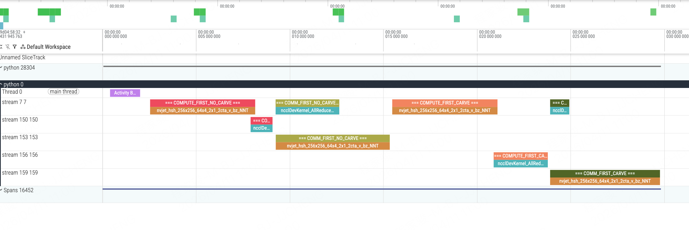

# 计算通信overlap

<<<<<<< HEAD
计算通信overlap的思想将部分计算和通信进行解耦，在本地进行当前chunk的计算的同时进行其他chunk的通信
=======
实验分为两个部分
- 是否预留SM
- 通信stream和计算stream的顺序

如下所示

我们可以发现在尝试进行计算通信overlap的时候最好是将通信的stream给放到前面，然后再开始计算的stream
>>>>>>> 17becbfa270e27a6c38c94618c00c24fa6afaafb

