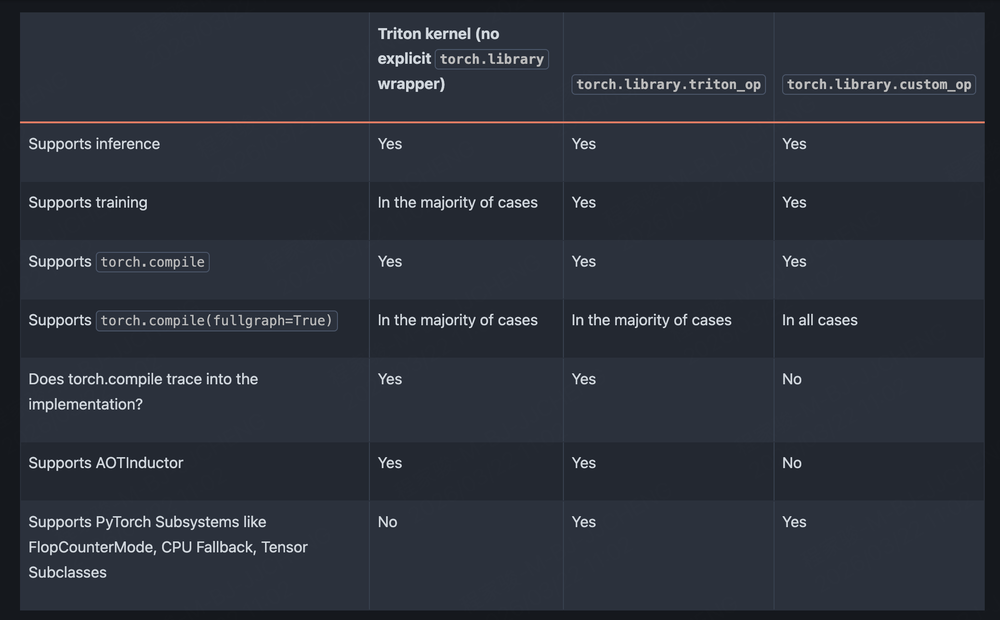

# torch compile 优化

torch.compile 是一个优化技术可以加速torch代码，将pytorch代码都给转换为JIT编译的优化内核

[code](./demo.py) 中展示了使用torch.compile的demo

编译产生的图如下所示

```shell
V0322 09:42:56.339000 144730 site-packages/torch/_dynamo/output_graph.py:1983] [1/0] [__graph_code]     def forward(self, L_x_: "f32[3, 3][3, 1]cpu", L_y_: "f32[3, 3][3, 1]cpu"):
V0322 09:42:56.339000 144730 site-packages/torch/_dynamo/output_graph.py:1983] [1/0] [__graph_code]         l_x_ = L_x_
V0322 09:42:56.339000 144730 site-packages/torch/_dynamo/output_graph.py:1983] [1/0] [__graph_code]         l_y_ = L_y_
V0322 09:42:56.339000 144730 site-packages/torch/_dynamo/output_graph.py:1983] [1/0] [__graph_code]         
V0322 09:42:56.339000 144730 site-packages/torch/_dynamo/output_graph.py:1983] [1/0] [__graph_code]          # File: /volume/code/chengjiajun/workspace/AI-infra-LearningNote/05-framework/pytorch/compile/demo.py:15 in opt_foo2, code: a = torch.sin(x)
V0322 09:42:56.339000 144730 site-packages/torch/_dynamo/output_graph.py:1983] [1/0] [__graph_code]         a: "f32[3, 3][3, 1]cpu" = torch.sin(l_x_);  l_x_ = None
V0322 09:42:56.339000 144730 site-packages/torch/_dynamo/output_graph.py:1983] [1/0] [__graph_code]         
V0322 09:42:56.339000 144730 site-packages/torch/_dynamo/output_graph.py:1983] [1/0] [__graph_code]          # File: /volume/code/chengjiajun/workspace/AI-infra-LearningNote/05-framework/pytorch/compile/demo.py:16 in opt_foo2, code: b = torch.cos(y)
V0322 09:42:56.339000 144730 site-packages/torch/_dynamo/output_graph.py:1983] [1/0] [__graph_code]         b: "f32[3, 3][3, 1]cpu" = torch.cos(l_y_);  l_y_ = None
V0322 09:42:56.339000 144730 site-packages/torch/_dynamo/output_graph.py:1983] [1/0] [__graph_code]         
V0322 09:42:56.339000 144730 site-packages/torch/_dynamo/output_graph.py:1983] [1/0] [__graph_code]          # File: /volume/code/chengjiajun/workspace/AI-infra-LearningNote/05-framework/pytorch/compile/demo.py:17 in opt_foo2, code: return a + b
V0322 09:42:56.339000 144730 site-packages/torch/_dynamo/output_graph.py:1983] [1/0] [__graph_code]         add: "f32[3, 3][3, 1]cpu" = a + b;  a = b = None
V0322 09:42:56.339000 144730 site-packages/torch/_dynamo/output_graph.py:1983] [1/0] [__graph_code]         return (add,)
```

## 图断裂

torch.compile显然不是万能的，当其中出现一些条件语句的时候，其就会被break成多个图

如下所示，在if的条件语句哪里会break子图

```python3
def bar(a, b):
    x = a / (torch.abs(a) + 1)
    if b.sum() < 0:
        b = b * -1
    return x * b
```

对于这样的代码我们可以写成`torch.where`从而进行消除

## handle with triton kernel

