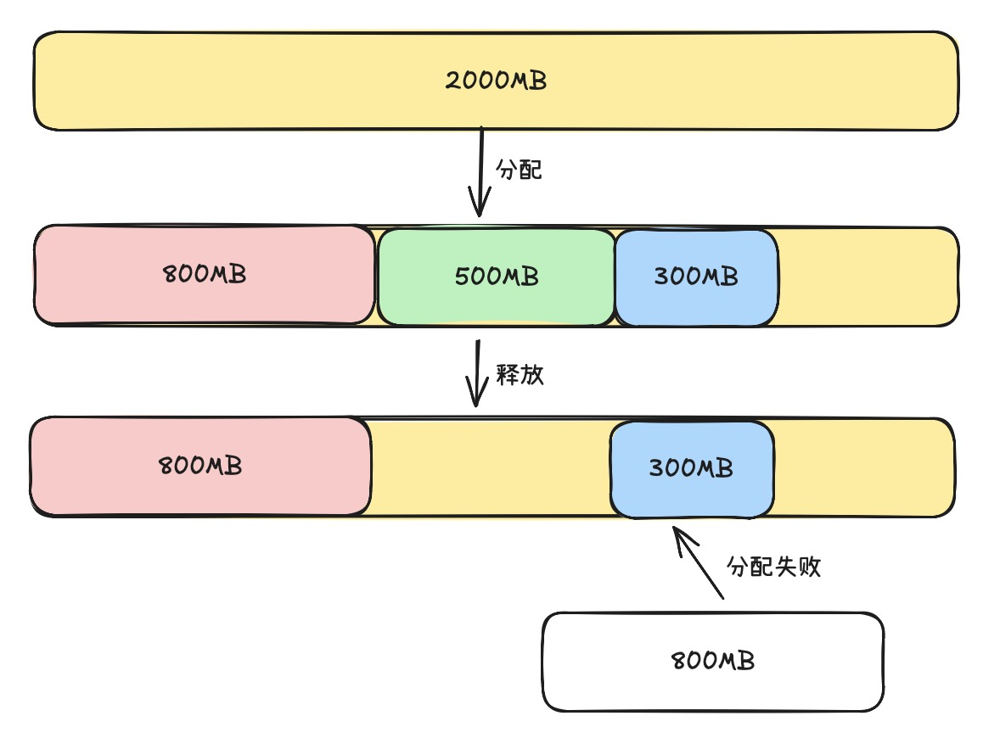

# Torch 显存分配

## 0. 显存相关API

`torch.cuda.memory_allocated`可以获取当前分配的显存大小
`torch.cuda.memory_reserved`可以获取当前缓存池大小

缓存池的大小 = 当前分配的显存的大小 + 显存碎片的大小

这个图就很形象，其实和CPU里的显存碎片是一样的



```python
def print_mem(step_name):
    alloc = torch.cuda.memory_allocated() / (1024**2)
    reserved = torch.cuda.memory_reserved() / (1024**2)
    print(f"[{step_name:<20}] 分配显存(Allocated): {alloc:>7.2f} MB | 缓存池(Reserved): {reserved:>7.2f} MB")
```

## 1. 模型的显存

### 1.1 加载模型时的显存

```python
    model = nn.Sequential(
        nn.Linear(1024, 8192),
        nn.ReLU(),
        nn.Linear(8192, 8192),
        nn.ReLU(),
        nn.Linear(8192, 1024)
    ).cuda()
    print_mem("加载模型权重后")
```

有三个线性层，每个层的大小分别为`1024, 8192` 和 `8192, 8192` 和 `8192, 1024`

```shell
=================================================================
 阶段一：初始化模型与数据
=================================================================
[完全初始状态              ] 分配显存(Allocated):    0.00 MB | 缓存池(Reserved):    0.00 MB
[加载模型权重后             ] 分配显存(Allocated):  320.07 MB | 缓存池(Reserved):  322.00 MB
```

当加载输入数据后，有一片输入空间此外还有一片输出一共32MB的空间

```shell
[加载输入数据后             ] 分配显存(Allocated):  352.07 MB | 缓存池(Reserved):  354.00 MB
```

### 1.2 模型训练阶段

在模型的训练阶段需要保存中间的激活值。

layer1阶段的激活值大小为 4096 * 8192 * 4 / (1024^2) = 128MB
layer2阶段的激活值大小为 4096 * 8192 * 4 / (1024^2) = 128MB
layer3阶段的激活值大小为 4096 * 1024 * 4 / (1024^2) = 16MB

所以理论增加的值为 128 + 128 + 16 = 272 MB

中间空闲的24MB空间为自动求导图的临时开销

```shell
[前向传播完成              ] 分配显存(Allocated):  648.19 MB | 缓存池(Reserved):  758.00 MB
```

进行反向传播，释放中间的激活值，同时增加梯度的开销

648 - 256 + 320 = 720MB

然后增加优化器，一阶动量和二阶动量都需要存放

720 + 320 + 320 = 1360MB

```shell
[优化器 Step 完成         ] 分配显存(Allocated): 1360.52 MB | 缓存池(Reserved): 2038.00 MB
```

清空梯度，但是优化器保存下来了

1360 - 320 = 1040MB
