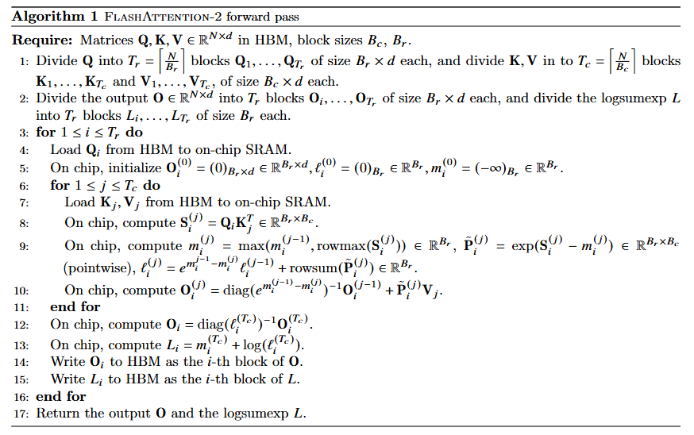
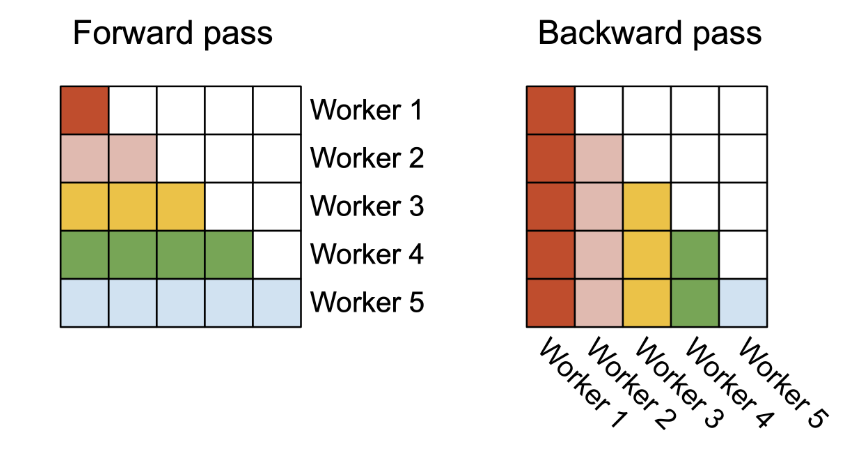

# FlashAttention

FlashAttention 是一种分块方式的Attention，其利用了SRAM进行优化，来减少从HBM的访存。

```python3
class FlashAttention(object):
    def __init__(self, row_block_size: int, col_block_size: int) -> None:
        """
        Flash Attention in Numpy.
        
        Reference: 
            <<FLASHATTENTION: Fast and Memory-Efficient Exact Attention with IO-Awareness>>
            https://proceedings.neurips.cc/paper_files/paper/2022/file/67d57c32e20fd0a7a302cb81d36e40d5-Paper-Conference.pdf
        
        row_block_size: block size of query
        col_block_size: block size of key
        
        """
        # (Line 1): set the block size. 
        # We manually set the block size for query and key, respectively, since we do not know the on-chip SRAM size of GPU.
        self.row_block_size = row_block_size
        self.col_block_size = col_block_size

    def _validity_check(self, q: np.ndarray, k: np.ndarray, v: np.ndarray) -> None:
        assert q.ndim == 3, "q should be a 3D tensor"      # [batch_size, seq_len, hidden_size]
        assert k.ndim == 3, "k should be a 3D tensor"
        assert v.ndim == 3, "v should be a 3D tensor"
        assert q.shape[0] == k.shape[0], "batch_size of q and k should be the same"
        assert q.shape[2] == k.shape[2] == v.shape[2], "hidden_size of q, k and v should be the same"
        assert q.shape[1] % self.row_block_size == 0 and k.shape[1] % self.col_block_size == 0, \
            "seq_len should be divisible by block_size"

    @staticmethod
    def load(arr, st, ed, step):
        """Simulate the process that moves data from HBM to SRAM"""
        return arr[:, st * step: ed * step]

    @staticmethod
    def write(arr, val, st, ed, step):
        """Simulate the process that moves data from SRAM to HBM"""
        arr[:, st * step: ed * step] = val

    def forward(self, q, k, v):
        """
        The following implementation strictly follows the Algorithm 1 in the paper of FLASH-ATTENTION.
        Except that we put it in a batched way, i.e. the batch_size is the first dimension of q, k, v.
        Algorithm 1 is on the 5th page of the orginal paper of FLASH-ATTENTION.
        """

        self._validity_check(q, k, v)
        batch_size, q_len, hidden_size = q.shape
        k_len = k.shape[1]

        # (Line 2): initialize O, l and m
        # O: output, will be updated in a row-block-wise manner
        out = np.zeros((batch_size, q_len, hidden_size))
        # l: exp-sum of each row block, will be the denominator in softmax. 
        # l will be updated in a exponential moving average way.
        l = np.zeros((batch_size, q_len))
        # m: max of each row block, will be part of the numerator in softmax.
        # m will also be updated in a exponential moving average way.
        m = np.zeros((batch_size, q_len))
        m.fill(-np.inf)

        # (Line 3): divide q into row blocks and k, v into column blocks
        Tr = q_len // self.row_block_size       # Tr: number of row blocks
        Tc = k_len // self.col_block_size       # Tc: number of column blocks

        # (Line 4): pass. We do not need to explicitly split the output into row blocks, 
        # but we will update the output in a row-block-wise manner to simulate the process of FLASH-ATTENTION.
        
        # (Line 5): iterate over column blocks
        for j in range(Tc):

            # (Line 6), load the key and value block
            # kj: key block, [batch_size, col_block_size, hidden_size]
            # vj: value block, [batch_size, col_block_size, hidden_size]
            kj = self.load(k, j, j + 1, self.col_block_size)
            vj = self.load(v, j, j + 1, self.col_block_size)

            # (Line 7): iterate over row blocks
            for i in range(Tr):
                
                # (Line 8): load the query block. [batch_size, row_block_size, hidden_size]
                qi = self.load(q, i, i + 1, self.row_block_size)
                oi = self.load(out, i, i + 1, self.row_block_size)
                mi = self.load(m, i, i + 1, self.row_block_size)
                li = self.load(l, i, i + 1, self.row_block_size)

                # (Line 9): compute the dot-product attention score
                sij = np.matmul(qi, kj.transpose(0, 2, 1)) / np.sqrt(hidden_size)

                # (Line 10): compute max, softmax, and exp-sum
                mij = np.max(sij, axis=-1)                                              # [batch_size, row_block_size]
                pij = np.exp((sij - mij[..., np.newaxis]))                              # [batch_size, row_block_size, col_block_size]
                lij = pij.sum(axis=-1)                                                  # [batch_size, row_block_size]

                # (Line 11): update m and l
                # 11.a. update m, the max of each row block
                m_new = np.maximum.reduce([mi, mij])
                # 11.b. update l, the accumulated exp-sum of each row block
                l_new = np.exp(mi - m_new) * li + np.exp(mij - m_new) * lij

                # (Line 12): update output
                temp = li[..., np.newaxis] * np.exp(mi - m_new)[..., np.newaxis] * oi + np.exp(mij - m_new)[..., np.newaxis] * np.matmul(pij, vj)
                temp /= l_new[..., np.newaxis]
                self.write(out, temp, i, i + 1, self.row_block_size)

                # (Line 13): store the m and l of current row block to the global m and l
                self.write(m, m_new, i, i + 1, self.row_block_size)
                self.write(l, l_new, i, i + 1, self.row_block_size)

        return out


    def __call__(self, *args, **kwargs):
        return self.forward(*args, **kwargs)
```


# FlashAttentionV2

FlashAttentionV2修改了FlashAttention的计算方式，利用了TensorCore来计算矩阵乘法，加速了这部分的计算。同时相比于FlashAttention改为从最外层先取出Q，然后内层取出K，V，相比于FlashAttention而言。减少了对Qi从HBM中的反复读写。Qi始终被保存在SRAM中。



## 并行方法

在最早期的FlashAttention中是针对batch和head进行并行，而FlashAttentionV2针对sequence length的维度进行并行。

在Forward pass中，进行维度的交换从而实现并行，在seq len较大和head 较小的情况下效果显著。

在Backward pass中，同样也是在seq len维度上进行并行。



```python3
    def forward(self, q: np.ndarray, k: np.ndarray, v: np.ndarray):
        batch_size, seq_len, hidden_dim = q.shape
        k_len = k.shape[1]
        out = np.zeros((batch_size, seq_len, hidden_dim))
        Tr = seq_len // self.row_block_size
        Tc = k_len // self.col_block_size
        for i in range(Tr):
            Qi = self.load(q, i, i + 1, self.row_block_size)
            oi = np.zeros((batch_size, self.row_block_size, hidden_dim))
            li = np.zeros((batch_size, self.row_block_size, 1))
            mi = np.zeros((batch_size, self.row_block_size, 1))
            mi.fill(-np.inf)
            for j in range(Tc):
                kj = self.load(k, j, j + 1, self.col_block_size)
                vj = self.load(v, j, j + 1, self.col_block_size)
                Sij = np.matmul(Qi, kj.transpose(-1, -2))
                mi_new = np.max(mi, np.maximum.reduce(Sij)) # todo
                Sij_max = np.max(Sij, axis=1, keepdims=True)  # 步骤1：行最大值并保持维度
                stacked = np.column_stack([mi, Sij_max])      # 步骤2：按列堆叠
                mi_new = np.max(stacked, axis=1, keepdims=True)  # 步骤3：行最大值并保持维度
                pij = np.exp(Sij - mi_new)
                li = np.exp(mi-mi_new)*li + np.sum(pij, axis=1)[:, np.newaxis]
                oi = oi * np.exp(mi - mi_new) + pij @ vj
                mi = mi_new
            oi = oi / li
            self.write(out, oi, i, i + 1, self.row_block_size)
```

# FlashAttentionV3

