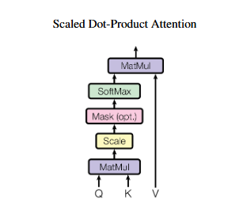
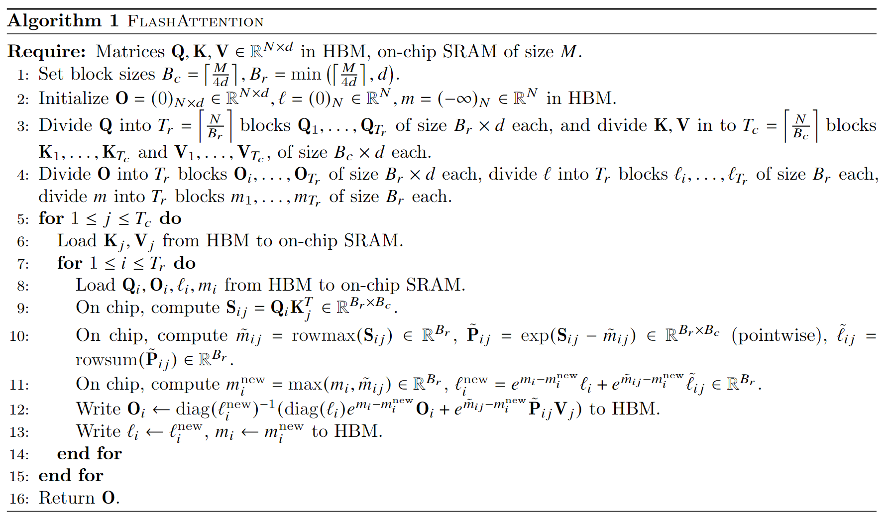

# Attention 介绍

## 1. Attention起源

Attention最早由google提出，发表在Neruips上[paper link](https://proceedings.neurips.cc/paper_files/paper/2017/file/3f5ee243547dee91fbd053c1c4a845aa-Paper.pdf)。在以往的架构如RNN中，模型的并行度较低，使用自注意力机制的Transformer架构则很好地解决了这一问题

## 2 scaled Dot-product Attention

最简单的架构是如下的缩放点积注意力，将Q和K进行相乘，然后经过放缩和softmax的操作，再和V相乘，得到Attention的输出结果。

其公式为

$Attention(Q, K, V) = softmax(\frac{QK^T}{\sqrt{d_k}})V$



实现的代码如下所示

```python3
class ScaledDotProductAttetion(nn.Module):
    def __init__(self, dim) -> None:
        super().__init__()
        self.dim = dim
        # 将Q，K，V放入到一个中
        self.proj = nn.Linear(dim, dim*3)
        self.att_drop = nn.Dropout(0.1)
        self.output_proj = nn.Linear(dim, dim)
    
    def forward(self, X, attention_mask=None):
        QKV = self.proj(X)
        # X shape (batch, seq, dim)
        Q, K, V = torch.split(QKV, self.dim, dim=-1)
        # Q, K, V shape (batch, seq, dim)
        # Q = (batch, seq, dim)
        # k -> (batch, dim, seq)
        att_weight = Q @ K.transpose(-1, -2)/math.sqrt(self.dim)
        # att_weight -> (batch, seq, seq)
        if attention_mask is not None:
            att_weight = att_weight.masked_fill(attention_mask == 0, float('-inf'))
        att_weight = torch.softmax(att_weight, dim=-1)

        att_weight = self.att_drop(att_weight)

        output = att_weight @ V
        # output -> (batch, seq, dim)
        ret = self.output_proj(output)
        return ret
```

## 3. Multi-Head Attention

缩放点积注意力每次仅进行一次Attention的操作，如果将其转换为K次的Attention操作，那么我们可以将其改写为如下所示的公式

$MultiHead(Q, K, V) = Concat(head1, ..., headh)$

$head_i = Attention(QW_i^Q, KW_i^K, VW_i^V)$

```python3
class MultiHeadAttention(nn.Module):
    def __init__(self, hidden_dim, nums_head) -> None:
        super().__init__()
        self.nums_head = nums_head
        self.head_dim = hidden_dim//nums_head
        self.hidden_dim = hidden_dim

        self.q_proj = nn.Linear(hidden_dim, hidden_dim)
        self.k_proj = nn.Linear(hidden_dim, hidden_dim)
        self.v_proj = nn.Linear(hidden_dim, hidden_dim)

        self.att_dropout = nn.Dropout(0.1)
        self.o_proj = nn.Linear(hidden_dim, hidden_dim)

    def forward(self, X, attention_mask=None):
        batch_size, seq_len, _ = X.size()

        Q = self.q_proj(X)
        K = self.k_proj(X)
        V = self.k_proj(X)

        q_state = Q.view(batch_size, seq_len, self.nums_head, self.head_dim).transpose(1, 2)
        k_state = K.view(batch_size, seq_len, self.nums_head, self.head_dim).transpose(1, 2)
        v_state = V.view(batch_size, seq_len, self.nums_head, self.head_dim).transpose(1, 2)

        attention_weight = (
            q_state@k_state.transpose(-1, -2)/math.sqrt(self.head_dim)
        )
        if attention_mask is not None:
            attention_weight = attention_weight.masked_fill(
                attention_mask == 0, float("-1e20")
            )
        attention_weight = torch.softmax(attention_weight, dim=3)

        # batch_size, seq_len, nums_head, nums_head
        attention_weight = self.att_dropout(attention_weight)
        output_mid = attention_weight @ v_state
        # batch_size, seq_len, nums_head, head_dim
        output_mid = output_mid.transpose(1, 2).contiguous()
        output = output_mid.view(batch_size, seq_len, -1)
        output = self.o_proj(output)
        return output
```

## 4. Multi Query Attention

Multi Query Attention 中所有的查询头都被分到一组内


## 5. Group query attention

GroupQuery将查询头分成G组，每组内会将共享单个键头和值头，其中的Q矩阵形状保持不变，而K，V矩阵的形状需要改变为
`(hidden_dim, nums_key_value_head*head_dim)` 

```python3
class GroupQueryAttention(nn.Module):
    def __init__(self, hidden_dim, nums_head, nums_key_value_head):
        super().__init__()
        assert self.hidden_dim % nums_head == 0
        assert nums_head % nums_key_value_head == 0

        self.hidden_dim = hidden_dim
        self.nums_head = nums_head
        self.nums_key_value_head = nums_key_value_head
        self.head_dim = hidden_dim // nums_head

        self.q_proj = nn.Linear(hidden_dim, nums_head*self.head_dim)
        self.k_proj = nn.Linear(hidden_dim, nums_key_value_head * self.head_dim)
        self.v_proj = nn.Linear(hidden_dim, nums_key_value_head * self.head_dim)

        self.o_proj = nn.Linear(hidden_dim, hidden_dim)

    def forward(self, X, attention_mask=None):
        batch_size, seq, _ = X.size()

        q = self.q_proj(X)
        k = self.k_proj(X)
        v = self.v_proj(X)

        # attention_weight 目标shape 是 (batch, nums_head, seq, seq)
        q = q.view(batch_size, seq, self.nums_head, self.head_dim)
        k = k.view(batch_size, seq, self.nums_key_value_head, self.head_dim)
        v = v.view(batch_size, seq, self.nums_key_value_head, self.head_dim)

        # 关注: nums_head 和 nums_key_value_head 的关系
        q = q.transpose(1, 2) # (b, nums_head, seq, head_dim)
        k = k.transpose(1, 2) # (b, nums_key_value_head, seq, head_dim)
        v = v.transpose(1, 2)  # (b, nums_key_value_head, seq, head_dim)

        # k v repeat； （广播操作）
        k = k.repeat_interleave(self.nums_head // self.nums_key_value_head, dim=1)
        v = v.repeat_interleave(self.nums_head // self.nums_key_value_head, dim=1)

        attention_score = (q @ k.transpose(2, 3)) / math.sqrt(self.head_dim)
        attention_weight = torch.softmax(attention_score, dim=-1)
        output = attention_weight @ v  # (b, nums_head, seq, head_dim)
        output = output.transpose(1, 2).contiguous()
        final_output = self.o_proj(output.view(batch_size, seq, -1))

        return final_output
```

## 6. FlashAttention

FlashAttention的实现目前可以被分为V1，V2，V3三种

### 6.1 FlashAttention V1

V1中需要对数据进行分块的操作，每次计算一块进行输出，然后使用 online softmax 对分块进行softmax的操作。

完整算法流程如下所示



- 根据SRAM的大小，计算合适的分块Block大小
- 将O，l，m在HBM中初始化为对应shape的全0的矩阵或向量
- 将Q，K，V切分为对应数量的Blocks
- 执行outer loop，在outer loop中，IO操作是将分块的K，V从HBM中加载到SRAM中
- 执行inner loop，将Qi,Oi, li, mi 从HBM中load到SRAM中，以分块的形式计算中间值

```python3
import torch
import torch.nn as nn
import torch.nn.functional as F
import math

N, d = 16, 8

Q_mat = torch.rand((N, d))
K_mat = torch.rand((N, d))
V_mat = torch.rand((N, d))

Br,Bc = 4,d

O = torch.zeros((N, d))
l = torch.zeros((N, 1))
m = torch.full((N, 1), -torch.inf)

for block_start_Bc in range(0, N, Bc):
    block_end_Bc = block_start_Bc + Bc
    Kj = K_mat[block_start_Bc:block_end_Bc, :]
    Vj = V_mat[block_start_Bc:block_end_Bc, :]

    for block_start_Br in range(0, N, Br):
        block_end_Br = block_start_Br + Br
        mi = m[block_start_Br:block_end_Br, :]
        li = l[block_start_Br:block_end_Br, :]
        Oi = O[block_start_Br:block_end_Br, :]
        Qi = Q_mat[block_start_Br:block_end_Br, :]
        
        Sij = Qi @ Kj.T

        mij_hat = torch.max(Sij, dim=1).values[:, None]

        pij_hat = torch.exp(Sij - mij_hat)
        lij_hat = torch.sum(pij_hat, dim=1)[:, None]

        mi_new = torch.max(torch.column_stack([mi, mij_hat]), dim=1).values[:, None]
        li_new = torch.exp(mi-mi_new) * li * torch.exp(mij_hat - mi_new)*lij_hat
        Oi = (li * torch.exp(mi - mi_new)*Oi/li_new) * (torch.exp(mij_hat - mi_new)*pij_hat/li_new) @ Vj

        m[block_start_Br:block_end_Br, :] = mi_new
        l[block_start_Br:block_end_Br, :] = li_new

        O[block_start_Br:block_end_Br, :] = Oi
```

