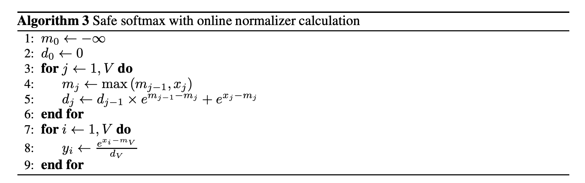
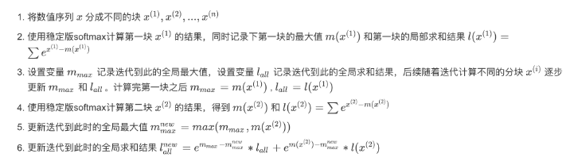

# Softmax 

## 1. 普通softmax

softmax的公式为 

$y_i = \frac{e^{x_i}}{\sum_{j=1}^{n} e^{x_j}}$

## 2. safe softmax

safe softmax会先计算出一个最大值，然后上下同时除以这个 $e^{max}$，这样做可以使得计算时的 $e^x$ 不会因为过大而溢出

$y_i = \frac{e^{x_i - max}}{\sum_{j=1}^{n} e^{x_j - max}}$


```cpp
__global__ void safeSoftMax(float *input, float *output, int rows, int cols) {
    int row = blockIdx.x * blockDim.x + threadIdx.x;
    if (row > rows ) return;
    float max_val = -INFINITY;
    for (int i = 0; i < cols; i++) {
        float val = input[row * cols + i];
        if (val > max_val) max_val = val;
    }
    float sum_exp = 0.0f;
    for (int i = 0; i < cols; i++) {
        float exp_val = expf(input[row * cols + i] - max_val);
        sum_exp += exp_val;
        output[row * cols + i] = exp_val;
    }
    for (int i = 0; i < cols; i++) {
        output[row * cols + i] /= sum_exp;
    }
}   

void launchsafeSoftMax(float *input, float *output, int rows, int cols) {
    dim3 blockSize(1024);
    dim3 gridSize((rows + blockSize.y - 1)/blockSize.x);
    safeSoftMax<<<gridSize, blockSize>>>(input, output, rows, cols);
}
```

## 3. online softmax

online softmax算法相比于safe softmax算法减少了访存的次数，其只计算当前的最大值，在计算出后续的更大值后进行补偿。



实现代码

```cpp
__global__ void onlineSoftMax(float *input, float *output, int rows, int cols) {
    int row = blockIdx.x * blockDim.x + threadIdx.x;
    if (row > rows ) return;
    float max_val = 0.0f;
    float now_val = 0.0f;
    float sum_exp = 0.0f;
    for (int i = 0; i < cols; i++) {
        now_val = max(max_val, input[row * cols + i]);
        float exp_val = expf(input[row * cols + i] - max_val);
        sum_exp = sum_exp * (now_val - max_val)  + exp_val;
        max_val = now_val;
    }
    for (int i = 0; i < cols; i++) {
        output[row * cols + i] = expf(input[row * cols + i] - max_val) / sum_exp;
    }
}   
```

## 4. tiled softmax

将数值序列x分为不同的块 $x_i$，然后对每个块进行softmax计算，最后将每个块的结果进行拼接，得到最终的结果。



