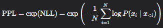

# 大模型语言能力评估

## 1. 负对数似然

负对数似然（Negative Log Likelihood，NLL）是概率论中的概念，用于描述概率分布的“似然”或“概率”。NLL 是一个用于评估概率分布的函数，它计算了给定概率分布和实际观测值之间的距离。

## 2. 困惑度

困惑度PPL是exp(NLL)，即NLL的对数形式，如下所示

## 3. Token Accuracy

Token Accuracy 是模型预测的下一个token和真实token完全匹配的比例

## 4. Calibration

模型预测的概率是否真实反映正确率
