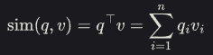
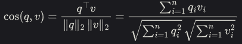

# 向量数据库

向量数据库更多地被应用于机器学习等领域，其数据查询策略是模糊匹配，将语义接近的数据进行关联

## 1. 词嵌入算法

早期最基础的算法为word2vec，然而word2vec由于其使用的是静态向量，所以其在不同语境下的向量仍然是相同的。而对于向量词嵌入算法而言，其可以更多地去理解上下文之间的语境，如bert模型等

## 2. 向量相似度

在向量数据库中相关数据是以向量形式进行存储的，为了比较两个向量之间的相似度，我们可以计算两个向量之间的距离，如果向量之间的距离越小，那么越相似

向量相似度有三种方法

### 2.1 欧氏距离

### 2.2 内积

可以从方向角度衡量向量的相似性，如果两个向量的方向接近，他们的夹角越小越相似

### 2.3 余弦相似度

## 3. 向量ANN搜索算法

### 3.1 IVF算法

- IVF算法可以分为下面的三步
    - 1. 聚类训练：使用kmeans算法将所有向量划分到nlist个簇，
    - 2. 向量分类：遍历数据集中的每一个向量，计算它与质心的距离，将其分配到最近的簇中
    - 3. 簇内精细化比较：在选定的簇的倒排索引中进行精细化的距离计算，具体方式取决于IVF的变体

### 3.2 LSH算法

- LSH算法可以分为下面的几步
    - 1. 构建随机超平面，在d维空间速记生成k个向量，每个向量的分布服从标准正太分布N(0, 1)
    - 2. 计算哈希签名，将每个超平面的结果拼接为一个二进制的串
    - 3. 构建多个哈希表来减少碰撞错误
    - 4. 查询，计算其在每个哈希表中的签名，找到桶中与哈希相同的候选样本，对候选样本计算真实相似度返回最为相似的topk

