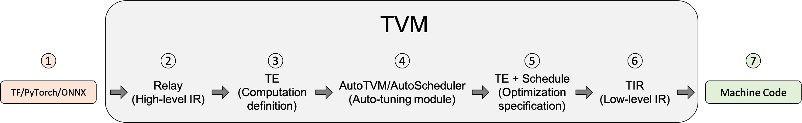

# TVM

TVM 是一个用于CPU，GPU和机器学习平加速器的开源机器学习编译器框架，可以针对不同的后端进行优化和计算。

TVM的步骤如下所示



- 从Tensorflow等框架中导入模型，
- 翻译为TVM的高级语言Relay
- 降级为张量表达式(TE)，使用较为低级的表示，
- 使用auto-tuning等调优模块来搜索最佳的调度方案
- 为模型编译选择最佳配置
- 降级为张量中间表示(TIR)，通过底层优化pass去进行优化】
- 编译成机器码，并生成可执行文件

## 1. example

先使用relax.frontend来构建一个简单的模型

```python
import tvm
from tvm import relax
from tvm.relax.frontend import nn


class MLPModel(nn.Module):
    def __init__(self):
        super(MLPModel, self).__init__()
        self.fc1 = nn.Linear(784, 256)
        self.relu1 = nn.ReLU()
        self.fc2 = nn.Linear(256, 10)

    def forward(self, x):
        x = self.fc1(x)
        x = self.relu1(x)
        x = self.fc2(x)
        return x
```

这是一个两层的MLP模型，继承自`relax`的`nn.module`

使用`export_tvm`方法将模型导出为TVM的`IRModule`

```python
mod, param_spec = MLPModel().export_tvm(
    spec={"forward": {"x": nn.spec.Tensor((1, 784), "float32")}}
)
mod.show()
```

输出的IR 如下所示

```python
@I.ir_module
class Module:
    @R.function
    def forward(x: R.Tensor((1, 784), dtype="float32"), fc1_weight: R.Tensor((256, 784), dtype="float32"), fc1_bias: R.Tensor((256,), dtype="float32"), fc2_weight: R.Tensor((10, 256), dtype="float32")) -> R.Tensor((1, 10), dtype="float32"):
        R.func_attr({"num_input": 1})
        with R.dataflow():
            permute_dims: R.Tensor((784, 256), dtype="float32") = R.permute_dims(fc1_weight, axes=None)
            matmul: R.Tensor((1, 256), dtype="float32") = R.matmul(x, permute_dims, out_dtype="void")
            add: R.Tensor((1, 256), dtype="float32") = R.add(matmul, fc1_bias)
            relu: R.Tensor((1, 256), dtype="float32") = R.nn.relu(add)
            permute_dims1: R.Tensor((256, 10), dtype="float32") = R.permute_dims(fc2_weight, axes=None)
            matmul1: R.Tensor((1, 10), dtype="float32") = R.matmul(relu, permute_dims1, out_dtype="void")
            gv: R.Tensor((1, 10), dtype="float32") = matmul1
            R.output(gv)
        return gv
```

对模型进行优化，优化分为两个层级
- 模型层级: 进行算子融合，布局转换等
- 张量层级：进行底层的优化，例如更换数学库，优化代码生成

模型运行

```python
import numpy as np

target = tvm.target.Target("llvm")
ex = tvm.compile(mod, target)
device = tvm.cpu()
vm = relax.VirtualMachine(ex, device)
data = np.random.rand(1, 784).astype("float32")
tvm_data = tvm.nd.array(data, device=device)
params = [np.random.rand(*param.shape).astype("float32") for _, param in param_spec]
params = [tvm.nd.array(param, device=device) for param in params]
print(vm["forward"](tvm_data, *params).numpy())
```

## 2. Tensor IR

## 3. tuning


