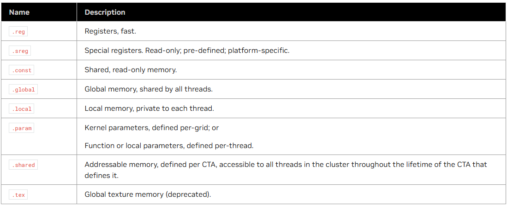
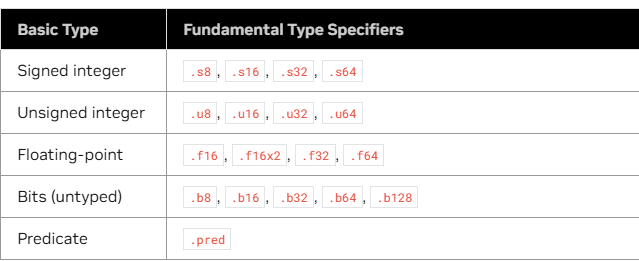
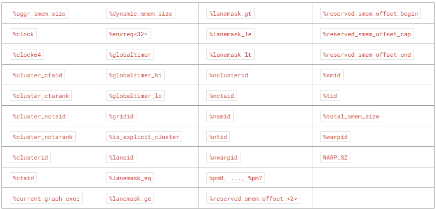

# PTX

PTX 是一种低级的多线程执行虚拟机和执行集，PTX将GPU公开为数据并行设备。

## 1. PTX 介绍

PTX 为并行编程提供了一套通用并行编程模型和指令集，


## 2 语法

下面是一个简单的PTX，其实和普通的汇编类似。

```cpp
        .reg     .b32 r1, r2;
        .global  .f32  array[N];

start:  mov.b32   r1, %tid.x;
        shl.b32   r1, r1, 2;          // shift thread id by 2 bits
        ld.global.b32 r2, array[r1];  // thread[tid] gets array[tid]
        add.f32   r2, r2, 0.5;        // add 1/2
```

在汇编语句中大致分为三种语句
- 状态空间
- 类型
- 变量
- 指令

### 2.1 状态空间

如下所示，常见的有 `.reg` 表示寄存器， `.global` 表示全局变量




### 2.2 类型

其类型如下所示，支持浮点，整数，bit等多种类型



### 2.3 变量

PTX 中有一些定义的标识符，其表示GPU中的时钟周期，进程编号等信息。

