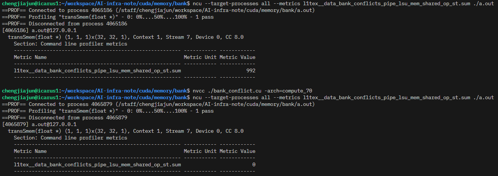

# bank 冲突

共享内存被划分为32个bank，bank的数据读取带宽则是32bit/cycle

bankIndex = (addr/BankSize)%BankNum(32)

Banksize = 4Byte * 层数，对于一维数据则是4Bytes


下面来看一个bank 冲突的例子


对于一个32x32的共享内存矩阵的转置，



上面的代码如下所示，bank冲突次数等于32*(32-1) = 992

```cpp
#include <cuda.h>
#include <iostream>

__global__ void transSmem(float* out) {
    __shared__ float matrix[32][32];
    // float now = matrix[threadIdx.x][threadIdx.y];
    matrix[threadIdx.x][threadIdx.y] = out[threadIdx.x + 32*threadIdx.y];

    __syncthreads();
    out[threadIdx.x + 32*threadIdx.y] = matrix[threadIdx.y][threadIdx.x];
}

int main() {
    dim3 block{32, 32};
    float *out;
    cudaMalloc((void**)&out, 32*32*4);
    transSmem<<<1, block>>>(out);
    cudaDeviceSynchronize();
}
```

下面的如下所示，bank冲突次数为0

```cpp
#include <cuda.h>
#include <iostream>

__global__ void transSmem(float* out) {
    __shared__ float matrix[32][32];
    // float now = matrix[threadIdx.x][threadIdx.y];
    matrix[threadIdx.y][threadIdx.x] = out[threadIdx.x + 32*threadIdx.y];

    __syncthreads();
    out[threadIdx.x + 32*threadIdx.y] = matrix[threadIdx.y][threadIdx.x];
}

int main() {
    dim3 block{32, 32};
    float *out;
    cudaMalloc((void**)&out, 32*32*4);
    transSmem<<<1, block>>>(out);
    cudaDeviceSynchronize();
}
```
## 消除bank冲突

### 1. pad方法
为了解决bank冲突，可以在最后一个维度进行pad，将32-33，来保证地址不被32整除，从而让不同线程访问不同bank的数据

```cpp
#include <cuda.h>
#include <iostream>

__global__ void transSmem(float* out) {
    __shared__ float matrix[32][33];
    // float now = matrix[threadIdx.x][threadIdx.y];
    matrix[threadIdx.x][threadIdx.y] = out[threadIdx.x + 32*threadIdx.y];

    __syncthreads();
    out[threadIdx.x + 32*threadIdx.y] = matrix[threadIdx.y][threadIdx.x];
}

int main() {
    dim3 block{32, 32};
    float *out;
    cudaMalloc((void**)&out, 32*32*4);
    transSmem<<<1, block>>>(out);
    cudaDeviceSynchronize();
}
```

### 2. 行列之和取余数

将行索引加上列索引模一个值，需要两步操作，一个加法一个取模

### 3. swizzle之行列号异或

只需要进行一步异或即可，cutlass中使用即使用该方法

```cpp

__global__ void transSmem(float* out) {
    __shared__ float matrix[32][32];
    matrix[threadIdx.y][threadIdx.x ^ threadIdx.y] = out[threadIdx.x + 32*threadIdx.y]; // 加载原始数据
    __syncthreads();
    out[threadIdx.x + 32*threadIdx.y] = matrix[threadIdx.x][threadIdx.x ^ threadIdx.y]; // 写入转置数据
}

int main() {
    dim3 block{32, 32};
    float *d_out, *out;
    cudaMalloc((void**)&d_out, 32*32*4);
    out = (float*)malloc(sizeof(float)*32*32);
    for (int i = 0; i < 32*32; i++) {
        out[i] = i;
    }
    cudaMemcpy(d_out, out, 32*32*sizeof(float), cudaMemcpyHostToDevice);
    transSmem<<<1, block>>>(d_out);
    cudaDeviceSynchronize();
    cudaMemcpy(out, d_out, 32*32*sizeof(float), cudaMemcpyDeviceToHost);
    for (int i = 0; i < 32;i++) {
        for (int j = 0; j < 32; j++) {
            printf("%.2f ", out[i*32+j]);
        }
        printf("\n");
    }

}
```
