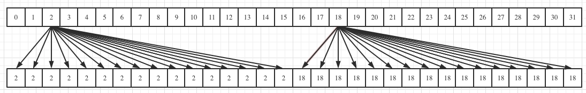

## 1. __all_sync

```cpp
__global__ void vote_all(int *a, int *b, int n)
 {
     int tid = threadIdx.x;
     if (tid > n)
         return;
     int temp = a[tid];
     b[tid] = __all_sync(0xffffffff, temp > 24); 
 }
```
表决函数，只有当一个warp内参与掩码数据都为1的时候，返回的值才为1

## 2. __any_sync

__any_sync 表示如果warp中的任何线程传递了非0的predicate，则返回非0

```cpp
__global__ void vote_any(int *a, int *b, int n)
 {
     int tid = threadIdx.x;
     if (tid > n)
         return;
     int temp = a[tid];
     b[tid] = __any_sync(0xffffffff, temp > 24); 
 }
```

## 3. __uni_sync

__uni_sync 只有当里面的数值全为0或者全部不为0的时候才会返回1

```cpp
__global__ void vote_uni(int *a, int *b, int n)
 {
     int tid = threadIdx.x;
     if (tid > n)
         return;
     int temp = a[tid];
     b[tid] = __uni_sync(0xffffffff, temp > 24); 
 }
```

## 4. __ballot_sync

__ballot_sync 用于获得在线程束内的predicate

```cpp
__global__ void ballot(int *a, int *b, int n)
 {
     int tid = threadIdx.x;
     if (tid > n)
         return;
     b[tid] = __ballot_sync(0xffffffff, a[tid] > 12);
 }
```

## 5. __shfl_sync

`_shfl_sync(mask, value, lanid, width=32)` width参数小于32的时候，以width宽度进行操作，选择其中的lanid位进行广播。

```cpp
__global__ void shfl(int *a, int *b, int n)
 {
     int tid = threadIdx.x;
     int value = tid & 0x1f;
     if (tid > n)
         return;
     int temp = a[tid];
     value = __shfl_sync(0xffffffff, value, 2, 8);
     b[tid] = value;
 }
// 输出
// 2 2 2 2 2 2 2 2 10 10 10 10 10 10 10 10 18 18 18 18 18 18 18 18 26 26 26 26 26 26 26 26
```


## 6. __shfl_up_sync

`T __shfl_up_sync(unsigned mask, T var, unsigned int delta, int width=warpSize)` 可以在width每个位置向 + delta 位置进行广播, (0-delta) 的位置保持不变

```cpp
__global__ void shfl_up(int *a, int *b, int n)
 {
     int tid = threadIdx.x;
     int value = tid & 0x1f;
     if (tid > n)
         return;
     int temp = a[tid];
     value = __shfl_up_sync(0xffffffff, value, 2, 8);
     b[tid] = value;
 }
```
`T __shfl_down_sync(unsigned mask, T var, unsigned int delta, int width=warpSize)` 可以在width每个位置向 - delta 位置进行广播


## 7. __shfl_xor_sync

`T __shfl_xor_sync(unsigned mask, T var, int laneMask, int width = warpSize)` 进行数据的交换，其mask表示参与的掩码，var表示参与运算的元素值，laneMask表示将laneID和laneMaks进行进行异或来得到交换的位置

```cpp
__global__ void shfl_xor(int *a, int *b, int n)
 {
     int tid = threadIdx.x;
     int value = tid & 0x1f;
     if (tid > n)
         return;
     int temp = a[tid];
     value = __shfl_xor_sync(0xffffffff, value, 2);
     b[tid] = value;
 }
```

## 8 __match_any_sync

`unsigned int __match_any_sync(unsigned mask, T value)` 表示比较被 mask指定的所有线程的变量，并具有相同值位置的掩码设置为1

## 9. __match_all_sync

`unsigned int __match_all_sync(unsigned mask, T value, int *pred)` 表示比较被 mask 指定的所有线程中的变量 value，当所有被指定的线程具有相同值的时候返回 mask 且 *pred 被置为 true，否则返回 0 且置 *pred 为 false。

