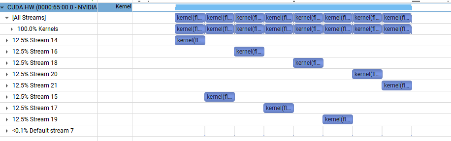

# cuda 流编程

在默认的kernel执行中，所有操作都会被放到一个stream中执行。多个kernel同时执行时其实是同步执行的。

如下面的例子，在每个stream后启动一个在默认stream上执行的kernel。

```cpp
#include <iostream>
#include <cuda.h>
#include <cuda_runtime.h>

using namespace std;

const int N = 1 << 20;

__global__ void kernel(float *x, int n)
{
    int tid = threadIdx.x + blockIdx.x * blockDim.x;
    for (int i = tid; i < n; i += blockDim.x * gridDim.x) {
        x[i] = sqrt(pow(3.14159,i));
    }
}

int main()
{
    const int num_streams = 8;

    cudaStream_t streams[num_streams];
    float *data[num_streams];

    for (int i = 0; i < num_streams; i++) {
        cudaStreamCreate(&streams[i]);
 
        cudaMalloc(&data[i], N * sizeof(float));
        
        // launch one worker kernel per stream
        kernel<<<1, 64, 0, streams[i]>>>(data[i], N);

        // launch a dummy kernel on the default stream
        kernel<<<1, 1>>>(0, 0);
    }

    cudaDeviceReset();

    return 0;
} 
```




假设没有的这个默认的stream在执行，那么多个stream之间将会进行异步的执行。

```cpp
int main()
{
    const int num_streams = 8;

    cudaStream_t streams[num_streams];
    float *data[num_streams];

    for (int i = 0; i < num_streams; i++) {
        cudaStreamCreate(&streams[i]);
 
        cudaMalloc(&data[i], N * sizeof(float));
        
        // launch one worker kernel per stream
        kernel<<<1, 64, 0, streams[i]>>>(data[i], N);
    }

    cudaDeviceReset();

    return 0;
} 
```

