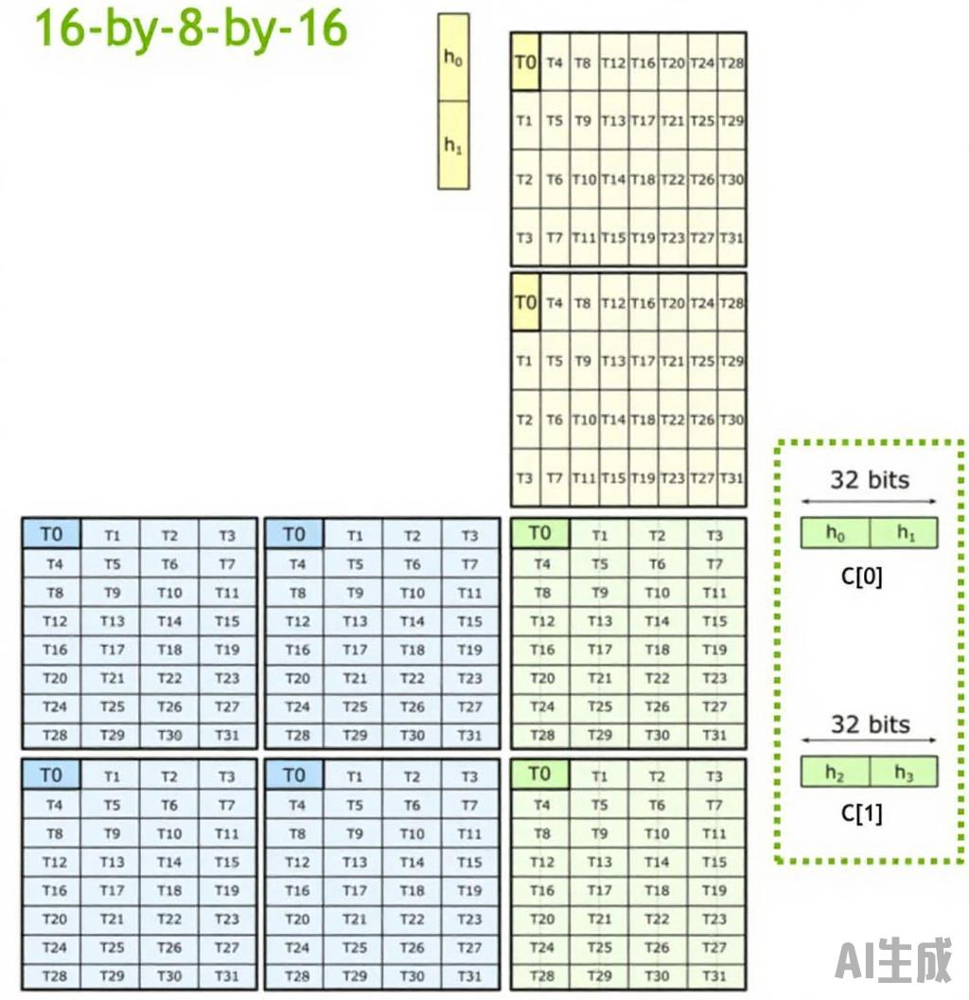

# TensorCore 加速

TensorCore 是英伟达GPU中的矩阵运算单元，我们可以通过mma指令来使用TensorCore 运算单元。mma指令是以warp为执行单位，

## 支持的数据type/shape


[具体文档](https://docs.nvidia.com/cuda/parallel-thread-execution/index.html?highlight=mma%2520sync%2520aligned%2520m8n8k4#warp-level-matrix-shape)


## 数据布局

在mma运算指令中，需要以warp为单位进行执行，warp中的每个线程计算部分数据，然后将其累加到输出的位置，例如对于16x8x16 的half类型矩阵乘法。需要用到32个线程，对于矩阵A，将其分为四部分，每部分的开始两个元素，被放入到mma输入中。对于矩阵B，则是将一列上的四个元素中间非连续元素放入到mma的输入中。最终的输出位置C的前半部分和后半部分。

```cpp
__global__ void mma_fp16_acc_fp32(float *out) {
  float c[4] = {0., 0., 0., 0.};
  float d[4] = {0., 0., 0., 0.};
  half a[8] = {1., 2., 1., 2., 1., 2., 1., 2.};
  half b[4] = {1., 2., 3., 4.};
  unsigned const *rA = reinterpret_cast<unsigned const *>(&a);
  unsigned const *rB = reinterpret_cast<unsigned const *>(&b);
  float const *rC = reinterpret_cast<float const *>(&c);
  float *rD = reinterpret_cast<float *>(&d);
  asm("mma.sync.aligned.m16n8k16.row.col.f32.f16.f16.f32 "
      "{%0,%1,%2,%3}, {%4,%5,%6,%7}, {%8,%9}, {%10,%11,%12,%13};\n"
      : "=f"(rD[0]), "=f"(rD[1]), "=f"(rD[2]), "=f"(rD[3])
      : "r"(rA[0]), "r"(rA[1]), "r"(rA[2]), "r"(rA[3]), "r"(rB[0]), "r"(rB[1]),
        "f"(rC[0]), "f"(rC[1]), "f"(rC[2]), "f"(rC[3]));
  printf("%f\n", rD[0]);
  memcpy(out + threadIdx.x * 2, rD, 8);
  memcpy(out + 8 * 8 + threadIdx.x * 2, rD + 2, 8);
}
```

用图来表示如下所示。




假设要计算 C = A * B 的一个最小块 16 * 8 * 16，具体代码如下所示

```cpp
__global__ void mma_fp16_acc_fp32(half* d_A, half* d_B, float *out) {
  float c[4] = {0., 0., 0., 0.};
  float d[4] = {0., 0., 0., 0.};

  int row = threadIdx.x / 4;
  int col = threadIdx.x % 4;
  int warpID = row * 8 + col;

  half b[4] = {d_B[col*8*2+row], d_B[col*8*2+row + 8], d_B[64+ col*8*2+row], d_B[64+ col*8*2+row+ 8]};
  unsigned const *rA = reinterpret_cast<unsigned const *>(d_A);
  unsigned const *rB = reinterpret_cast<unsigned const *>(b);
  float const *rC = reinterpret_cast<float const *>(&c);
  float *rD = reinterpret_cast<float *>(&d);
  asm("mma.sync.aligned.m16n8k16.row.col.f32.f16.f16.f32 "
      "{%0,%1,%2,%3}, {%4,%5,%6,%7}, {%8,%9}, {%10,%11,%12,%13};\n"
      : "=f"(rD[0]), "=f"(rD[1]), "=f"(rD[2]), "=f"(rD[3])
      : "r"(rA[warpID]), "r"(rA[warpID+64]), "r"(rA[warpID+4]), "r"(rA[warpID+68]), "r"(rB[0]), "r"(rB[1]),
        "f"(rC[0]), "f"(rC[1]), "f"(rC[2]), "f"(rC[3]));
  memcpy(out + threadIdx.x * 2, rD, 8);
  memcpy(out + 8 * 8 + threadIdx.x * 2, rD + 2, 8);
}

```

## 访存优化

`__cvta_generic_to_shared` 可以将一个普通的地址转换为共享内存的地址。

然后通过 `LDMATRIX_X4` 将共享内存地址的几个元素存入到一个普通的数组中，如下所示。

```cpp
#define LDMATRIX_X1(R, addr) \
    asm volatile("ldmatrix.sync.aligned.x1.m8n8.shared.b16 {%0}, [%1];\n" : "=r"(R) : "r"(addr))

#define LDMATRIX_X2(R0, R1, addr) \
    asm volatile("ldmatrix.sync.aligned.x2.m8n8.shared.b16 {%0, %1}, [%2];\n" : "=r"(R0), "=r"(R1) : "r"(addr))

#define LDMATRIX_X4(R0, R1, R2, R3, addr)                                             \
    asm volatile("ldmatrix.sync.aligned.x4.m8n8.shared.b16 {%0, %1, %2, %3}, [%4];\n" \
                 : "=r"(R0), "=r"(R1), "=r"(R2), "=r"(R3)                             \
                 : "r"(addr))
```

将数据从全局内存拷贝到L2/共享内存

```cpp
#if ((__CUDACC_VER_MAJOR__ == 11) && (__CUDACC_VER_MINOR__ >= 4)) || (__CUDACC_VER_MAJOR__ > 11)
#define CP_ASYNC_CA(dst, src, Bytes) \
    asm volatile("cp.async.ca.shared.global.L2::128B [%0], [%1], %2;\n" ::"r"(dst), "l"(src), "n"(Bytes))

#define CP_ASYNC_CG(dst, src, Bytes) \
    asm volatile("cp.async.cg.shared.global.L2::128B [%0], [%1], %2;\n" ::"r"(dst), "l"(src), "n"(Bytes))
#else
#define CP_ASYNC_CA(dst, src, Bytes) \
    asm volatile("cp.async.ca.shared.global [%0], [%1], %2;\n" ::"r"(dst), "l"(src), "n"(Bytes))

#define CP_ASYNC_CG(dst, src, Bytes) \
    asm volatile("cp.async.cg.shared.global [%0], [%1], %2;\n" ::"r"(dst), "l"(src), "n"(Bytes))
#endif
```

等待必要的组完成。

```cpp
#define CP_ASYNC_COMMIT_GROUP() asm volatile("cp.async.commit_group;\n" ::)

#define CP_ASYNC_WAIT_GROUP(N) asm volatile("cp.async.wait_group %0;\n" ::"n"(N))

#define CP_ASYNC_WAIT_ALL() asm volatile("cp.async.wait_all;\n" ::)
```