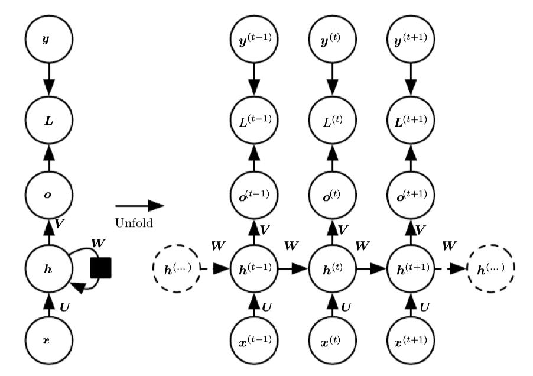

# RNN(Recurrent Neural Network,RNN)

循环神经网络是包含循环连接的网络，在循环神经网络中存在着输入层，隐藏层，输出层三个结构

- 输入层：将文本转换为数值表示，每个时间步接收一个输入元素
- 隐藏层：包含循环神经元，即将本次隐藏层的输出作为下次隐藏层的输入
- 输出层：基于当前隐藏状态得到输出的结果

假设t时刻的输入为 $x_t$,对应的输出为 $y_t$，中间的隐藏状态为 $h_t$,则 $h_t = \tanh(U h_{t-1}+ Wx_t)$，$y_t = f(Vh_t)$

循环的次数则是等于输入x的序列长度

在这个过程中由三个权重需要进行更新
- 输入层到隐藏层的权重W
- 前一时刻隐藏层到当前时刻隐藏层的权重U
- 隐藏层到输出层的权重V

## 反向传播

RNN的反向传播和传统神经网络结构的反向传播不同，U和W的值在每次时间步中都是共享的。所以其反向传播被称为 BPTT(Backpropagation Through Time)

- 输出层参数(W): 仅依赖当前时间步的隐藏状态 $h_t$

- 隐藏层参数(U,V): 

