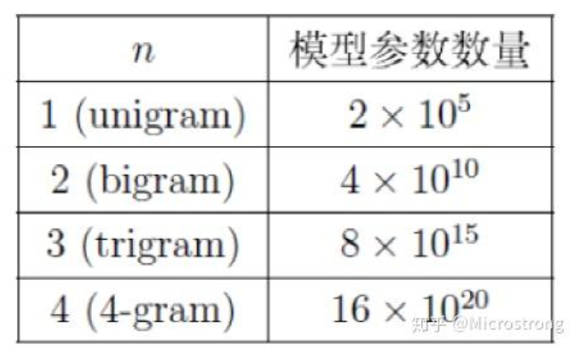
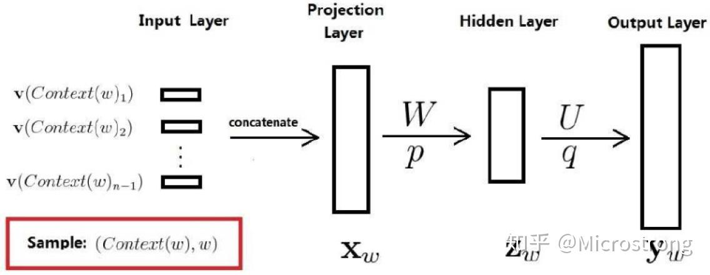

# word2vec

统计语言模型是用来计算一个句子的概率的概率模型，它通常基于一个语料库来构建。

$p(W) = p(w_1, w_2,...w_T) = P(w_1) P(w_2|w_1) P(w_3|w_1, w_2) ...  P(w_T|w_1, w_2, ..., w_{T-1})$

其中$P(w_1), P(w_2|w_1),....P(w_T|w_1, w_2, ..., w_{T-1})$ 是语言模型中的概率。通过的这些参数可以计算得到$ p(W)$。

## 1. N-gram模型

根据贝叶斯公式

$p(w_k|w_1, w_2, ..., w_{k-1}) = \frac{p(w_1...w_k)}{p(w_1...w_{k-1})}$

当语料库足够大，$p(w_k|w_1...w_{k-1}) = \frac{count(w_1...w_k)}{count(w_1...w_{k-1})}$ 

n_gram 算法则是只考虑它前面的N个词语，根据N分为不同内类，模型参数也不同

使用这种N-gram的方式的可以很好地降低参数的数量和计算的复杂度




N-gram 的代码如`n-gram.py`所示，其中展示的是一个trigram

## 2. 神经概率语言模型

神经概率语言模型，该论文中首次提出使用神经网络来处理语言模型问题。

先将词典D中的任意词w，指定一个固定长度的实值向量 $v(w)$，其被称为是词向量



该模型分为三层
- 第一层(输入层)：将 $C(W_{t - n + 1}), C(W_{t-2}), C(W_{t-1})$ 这n-1个向量首位拼接为 (n-1)xm的向量
- 第二层(隐藏层)：如同普通的神经网络，直接使用一个全连接层进行连接
- 第三层(输出层)：输出层，也是一个全连接层，每个输出节点 $y_i$ 表示下一个词语为i的未归一化log概率，最后用softmax激活函数对输出值y进行归一化

代码`nnlm.ipynb`所示


## 3. word2vec

word2vec 是一种基于神经概率语言模型的一种方法，该方法将词向量作为输入，将词向量作为输出，并使用一个隐藏层来处理输入和输出之间的联系。

首先建立一个词汇表进行词汇到索引之间的互相映射

```python3
def build_vocab(corpus):
    word_dict = defaultdict(int)
    for sentence in corpus:
        for word in sentence:
            word_dict[word] += 1
    sorted_words = sorted(word_dict.items(), key=lambda x: x[1], reverse=True)
    word2idx = {word: i+1 for i, (word, _) in enumerate(sorted_words)}
    idx2word = {i: word for i, (word, _) in enumerate(sorted_words)}
    return word2idx, idx2word
```

建立模型训练数据

```cpp
def create_contexts_target(corpus, window_size=2):
    contexts, targets = [], []
    for sentence in corpus:
        for i in range(window_size, len(sentence) - window_size):
            target = sentence[i]
            context = sentence[i-window_size:i] + sentence[i+1:i+window_size+1]
            contexts.append(context)
            targets.append(target)
    return np.array(contexts), np.array(targets)
```

模型的结构如下所示，使用一个embedding层和一个全连接层，通过对embedding层进行训练得到最终的向量数据，在进行前向传播的时候先得到embedding的输出，然后取平均，再通过线性层将其转换为一个词汇表大小的输出。

```python3
import torch.nn as nn

class CBOW(nn.Module):
    def __init__(self, vocab_size, embedding_dim):
        super(CBOW, self).__init__()
        self.embeddings = nn.Embedding(vocab_size, embedding_dim)
        self.linear = nn.Linear(embedding_dim, vocab_size)
        
    def forward(self, inputs):
        embeds = self.embeddings(inputs)  # [batch_size, context_size, embedding_dim]
        mean_embeds = torch.mean(embeds, dim=1)  # [batch_size, embedding_dim]
        out = self.linear(mean_embeds)  # [batch_size, vocab_size]
        return out
```

在进行反向传播时，使用交叉熵损失函数对比模型预测输出和实际输出的结果。


```python3
# 示例语料库
corpus = [
    ["the", "quick", "brown", "fox", "jumps"],
    ["over", "the", "lazy", "dog"]
]

# 参数设置
EMBEDDING_DIM = 100
WINDOW_SIZE = 2
BATCH_SIZE = 32
EPOCHS = 50

# 数据预处理
word2idx, idx2word = build_vocab(corpus)
contexts, targets = create_contexts_target(corpus, WINDOW_SIZE)

# 转换为PyTorch张量
context_tensor = torch.LongTensor([[word2idx[w] for w in ctx] for ctx in contexts])
target_tensor = torch.LongTensor([word2idx[t] for t in targets])

# 初始化模型
model = CBOW(len(word2idx)+1, EMBEDDING_DIM)
criterion = nn.CrossEntropyLoss()
optimizer = torch.optim.Adam(model.parameters())

# 训练循环
for epoch in range(EPOCHS):
    total_loss = 0
    for i in range(0, len(contexts), BATCH_SIZE):
        batch_context = context_tensor[i:i+BATCH_SIZE]
        batch_target = target_tensor[i:i+BATCH_SIZE]
        
        optimizer.zero_grad()
        outputs = model(batch_context)
        loss = criterion(outputs, batch_target)
        loss.backward()
        optimizer.step()
        total_loss += loss.item()
    
    print(f"Epoch {epoch+1}, Loss: {total_loss/len(contexts):.4f}")
```