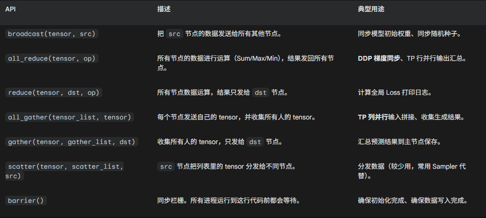

# Pytorch 分布式通信

Pytorch的分布式通信主要是基于torch.distributed这个库来进行完成的

其主要提供三种层级的API

1. 底层通信原语
2. 高级并行封装
3. RPC框架

## 1. 初始化

和mpi init，dist也需要去进行初始化

```python3
def demo(rank, world_size):
    torch.manual_seed(123)
    os.environ['MASTER_ADDR'] = 'localhost'
    os.environ['MASTER_PORT'] = '12354'
    
    # 1. 初始化
    dist.init_process_group("nccl", rank=rank, world_size=world_size)
```

启动时可以使用`mp.spawn`启动多个进程

```python3
if __name__ == "__main__":
    WORLD_SIZE = 2
    mp.spawn(demo, args=(WORLD_SIZE,), nprocs=WORLD_SIZE, join=True)
```

[线性层并行代码](./tpLinear.py) 如下所示

## 2. 通信接口

