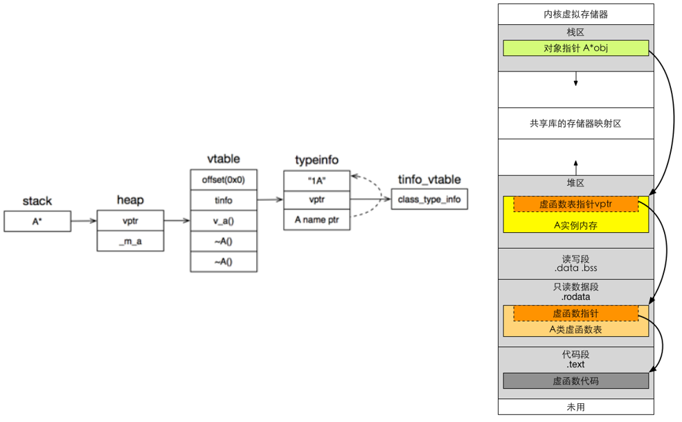
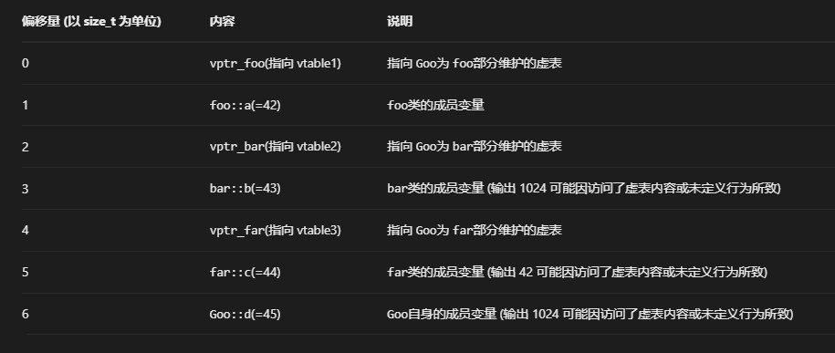

# 虚函数实现原理

虚函数是通过一张虚函数表实现的，被称为是V-table，在这个表中主要是一个类的虚函数的地址表。

## 虚函数的内存分布

主函数的栈帧上有一个 A 类型的指针指向堆里面分配好的对象 A 实例。紧接着A对象按照声明顺序排列的成员变量。vtable指针指向的是代码段的A类型的虚函数的第一个虚函数表的第一个虚函数起始地址。



## 虚函数的调用过程

首先通过对象内存的vptr找到虚函数表vtbl，然后通过vtbl找到对应虚函数的实现区域并进行调用。

在多继承的情况下，每个父类都有自己的虚表，子类的成员函数被放到第一个父类的表中，也就是说类在多重继承时，其实例对象的内存结构不止记录一个虚函数指针。基类中有几个存在虚函数，子类就会保存几个虚函数指针。

调用关系链 this->vptr->vtable->virtual_function

```cpp
#include <iostream>

using namespace std;
class foo
{
private:
    size_t a = 42;
public:
    virtual void fun1() {std::cout << "foo::fun1" << std::endl;}
    virtual void fun2() {std::cout << "foo::fun2" << std::endl;}
    virtual void fun3() {std::cout << "foo::fun3" << std::endl;}
};

class bar : public foo
{
private:
    size_t b = 43;
    size_t c = 44;

public:
    void fun1() override {std::cout << "bar::fun1" << std::endl;}
    void fun3() override {std::cout << "bar::fun3" << std::endl;}
};

using PF = void(*)();

void test(foo *pf) {
    size_t* virtual_point = (size_t*)pf;
    PF* pf1 = (PF*)*virtual_point;
    PF* pf2 = pf1 + 1;
    PF* pf3 = pf1 + 2;
    (*pf1)();
    (*pf2)();
    (*pf3)();
}
int main() {
    foo* fp = new foo();
    test(fp);
    fp = new bar();
    test(fp);
    size_t* virtual_point = (size_t*)fp;
    size_t* ap = virtual_point + 1;
    size_t* bp = virtual_point + 2;
    std::cout << *ap << std::endl;  //42
    std::cout << *bp << std::endl;  //1024
    std::cout << *(bp+1) << std::endl;  //1024
}
```
其内存分布如下所示


如上展示的是简单的单继承情况，下面将说明一下多继承的情况

如下所示goo继承了foo bar far三个类，
```cpp
#include <iostream>
#include <vector>
using namespace std;
class foo
{
private:
    size_t a = 42;
public:
    virtual void fun1() {std::cout << "foo::fun1" << std::endl;}
    virtual void fun2() {std::cout << "foo::fun2" << std::endl;}
    virtual void fun3() {std::cout << "foo::fun3" << std::endl;}
};

class bar
{
private:
    size_t b = 43;

public:
    virtual void fun4()  {std::cout << "bar::fun4" << std::endl;}
    virtual void fun5()  {std::cout << "bar::fun5" << std::endl;}
};


class far
{
private:
    size_t c = 44;

public:
    virtual void fun6() {std::cout << "far::fun6" << std::endl;}
    virtual void fun7() {std::cout << "far::fun7" << std::endl;}
};

class Goo: public foo, public bar, public far
{
private:
    size_t d = 45;

public:
virtual void fun2() override {std::cout <<"Goo::fun2" << std::endl;}

virtual void fun6() override {std::cout <<"Goo::fun6" << std::endl;}
};
using PF = void(*)();

void test(Goo *pf) {
    size_t* virtual_point = (size_t*)pf;
    PF* pf1 = (PF*)*virtual_point;
    PF* pf2 = pf1 + 1;
    PF* pf3 = pf1 + 2;
    PF* pf4 = pf1 + 3;

    (*pf1)();
    (*pf2)();
    (*pf3)();
    (*pf4)();
}
void test1(Goo *pf) {
    size_t* virtual_point = (size_t*)pf + 2;
    PF* pf1 = (PF*)*virtual_point;
    PF* pf2 = pf1 + 1;

    (*pf1)();
    (*pf2)();
}

void test2(Goo *pf) {
    size_t* virtual_point = (size_t*)pf + 4;
    PF* pf1 = (PF*)*virtual_point;
    PF* pf2 = pf1 + 1;

    (*pf1)();
    (*pf2)();
}

int main() { 
    // Goo g;
    // g.fun1();
    // g.fun2();
    // g.fun3();
    // g.fun4();
    // g.fun5();
    // g.fun6();
    Goo *gp = new Goo();
    test(gp);
    test1(gp);
    test2(gp);
    size_t* virtual_point = (size_t*)gp;
    size_t* ap = virtual_point + 1;
    size_t* bp = virtual_point + 3;
    size_t* cp = virtual_point + 5;
    size_t* dp = virtual_point + 6;
    std::cout << *ap << std::endl;  //42
    std::cout << *bp << std::endl;  //1024
    std::cout << *cp << std::endl;  //42
    std::cout << *dp << std::endl;  //1024
}
```

如下所示，这个多继承的数据布局



## tips

静态成员函数不能加上virtual，因为静态成员函数没有this指针