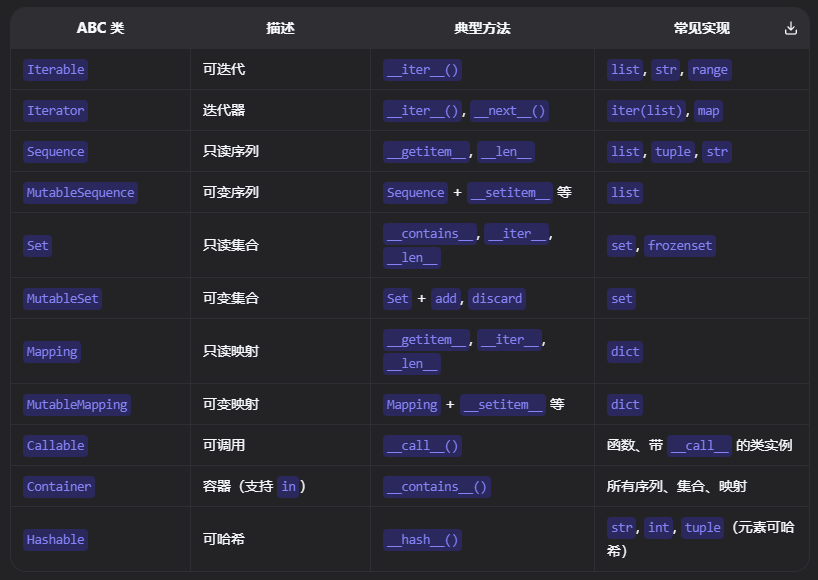

# 抽象基类

Abstract Base Class (ABC) 是 Python 3.4 新增的模块，用于创建抽象基类。抽象基类是一个类，它不能被实例化，只能被继承。继承抽象基类的子类必须实现抽象基类中的抽象方法，否则会报错。

```python3
from abc import ABCMeta, abstractmethod

class Fruit(metaclass=ABCMeta):
    
    def __init__(self, name):
        self.name = name
    
    @abstractmethod
    def bloom(self):
        pass

class Apple(Fruit):
    def __init__(self, name):
        super().__init__(name)
    
    def bloom(self):
        print(f"{self.name} is blooming")

apple = Apple("Apple")
apple.bloom()
```

## Python 内置的抽象基类

Python中定义了一个抽象基类来用于定义检测对象是否支持某种行为协议，这样使得我们可以判断



如下所示collections中定义了一个Sequence的行为协议，几种基础类型都实现了该协议

```python3
from collections.abc import Sequence

print(isinstance([1, 2, 3], Sequence))    # True
print(isinstance((1, 2, 3), Sequence))    # True
print(isinstance("hello", Sequence))      # True
print(isinstance(range(5), Sequence))     # True（range 也实现了协议）
```