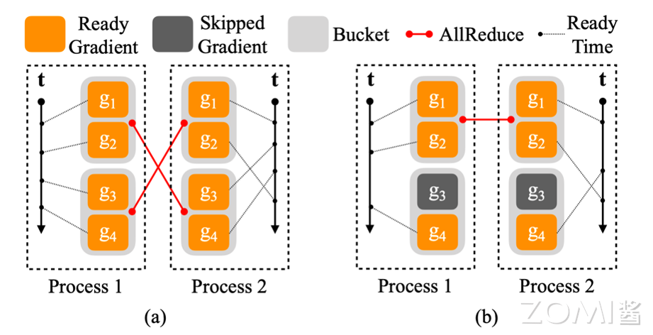

# 分布式数据并行

分布式数据并行对数据并行进行了优化。数据并行中使用的是多线程的方式，而分布式数据并行中使用的是多进程的方式，其可以处理单机多卡和多机多卡的情况。在开始的时候，将模型从主进程复制到其他进程。保证各计算卡的模型和优化器完全相同。

- 前向传播：每个 NPU 将分别拿到一块完整且不同的 mini-batch 数据，各 NPU 根据分配到的数据同时进行前向传播
- 损失计算和反向传播：前向传播完成后，各 NPU 将计算损失并进行反向传播。分布式数据并行中反向传播和梯度更新是同时进行，一旦某些局部梯度准备就绪，它们就会在所有过程中取平均值（默认是使用 Ring-AllReduce 算法做集合通信），然后使用全局梯度更新模型参数和优化器状态。

DDP的一些行为和MPI类似，每个进程都有一个自己的rank，rank为0的称为主线程。

## 1. DDP 前向传播

DDP的前向传播要求每次进行前向传播的进程的参数相同。

在构建的时候，通过`__sync_module_states`函数，将所有进程的参数进行同步, 在在前向传播的时候，通过`_sync_module_states `函数，将所有进程的buffer进行同步。

DDP 计算通信重叠， DDP中可以在完成部分梯度的计算后就进行通信，然后同时进行其他部分梯度的通信

