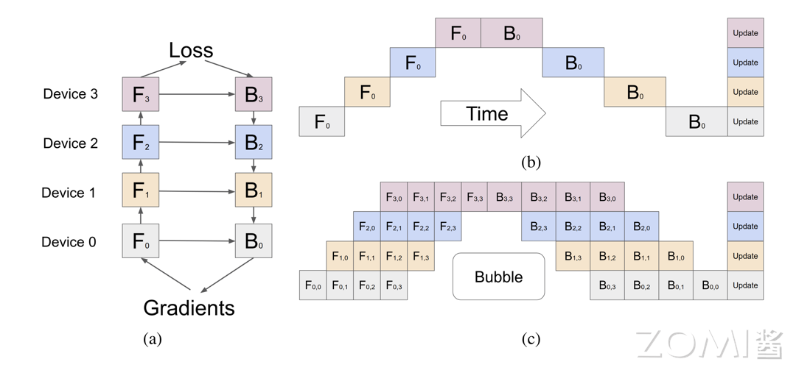

# 流水线并行

## 1.Gpipe

Gpipe 是一种用于加速神经网络模型训练的流水线并行技术，其将模型的计算任务分配到多个设备上，通过流水线化的方式使得模型的前向传播和反向传播可以重叠进行。

其思想类似CPU中的五段流水

在torch中我们可以使用 PipelineSchedule 去创建流水线,通过对模型进行手动或者自动的分割来实现流水线并行

针对于分布式的场景还可以使用 rpc 来进行数据的同步

## 2. PipeDream

PipeDream
