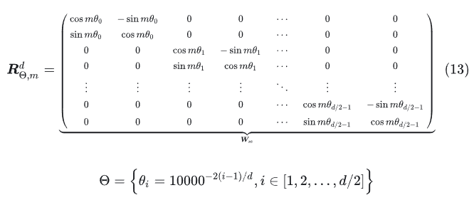
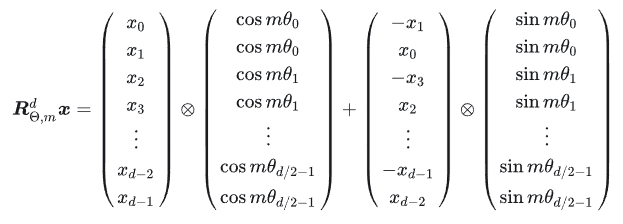

# 绝对位置编码

绝对位置编码指的是在输入序列经过词嵌入后的第k个token向量$x_k$中加入一个位置向量$p_k$，其中$p_k$是一个固定向量，其长度与词嵌入向量相同。

## 1. 三角函数式位置编码

三角函数式位置编码是在Transformer中用到的一种显式编码。以一维三角函数的编码为例

$p_{k,2i} = \sin(\frac{k}{10000^{2i/d}})$

$p_{k,2i+1} = \cos(\frac{k}{10000^{2i/d}})$

根据下面的公式，(a+b)位置的数据可以由位置a加位置b的向量组合而成。因此可以外推到任意的位置。

$\sin(\alpha + \beta) = \sin(\alpha)\cos(\beta) + \cos(\alpha)\sin(\beta)$

$\cos(\alpha + \beta) = \cos(\alpha)\cos(\beta) - \sin(\alpha)\sin(\beta)$

```python3
def SinusoidalEncoding1d(seq_len, d_model):
    pos_table = np.array([
        [pos / np.power(10000, 2 * i / d_model) for i in range(d_model)] 
        for pos in range(seq_len)])
    pos_table[1:, 0::2] = np.sin(pos_table[1:, 0::2])  # pos_table[0]作用于[CLS]，不需要位置编码
    pos_table[1:, 1::2] = np.cos(pos_table[1:, 1::2])                
    return torch.FloatTensor(pos_table)  
```

如果要外推到二维的形式，那么则需要在两个维度上同时进行位置编码

## 2. RoPE(旋转位置编码)

假设query向量$q_m$和key向量$k_n$之间的内积操作可以被一个函数g表示，该函数g的输入是词嵌入向量$x_m$和$x_n$，和他们之间的相对位置m-n

$<f_g(x_m,x_n),f_g(x_m,x_n)> =g(x_m,x_n,m-n)$

$f_q(x_m, m) = (W_qx_m)e^{im\theta}$

$f_k(x_n, n) = (W_kx_n)e^{in\theta}$

$g(x_m, x_n, m-n) = Re[(W_qx_m)(W_kx_n)*e^{i(m-n)\theta}]$

其中Re表示复数的实部

$f_q(x_m, m)$和$f_k(x_n, n)$是query和key的线性变换，而$e^{im\theta}$和$e^{in\theta}$则是旋转因子，其中$\theta$是一个参数，可以通过学习来调整。

拓展到任意的维度，可以得到


写成矩阵形式如下所示



为了RoPE的高效计算，实现起来如下所示

