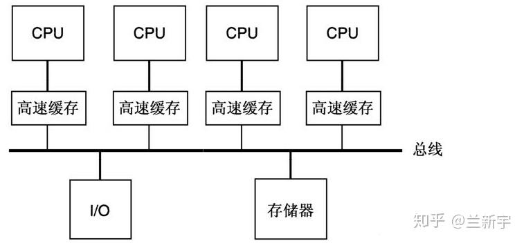
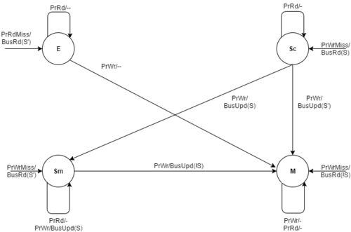

# cache 一致性

## 1. 单核一致性

cache 一致性指的是cache和内存之间的数据一致性

## 2. 多核一致性

多核一致性指的是每个CPU的cache之间的一致性。

多核之间的一致性需要依赖总线进行的实现，CPU从内存中读取数据到cacheline的操作被称为是load，将cacheline中的数据写回内存的操作被称为是store。这些操作都会经过总线，总线上的一次传输被称为是 transcation。

一个cpu的操作被同一总线上的其他CPU看到的操作被称为是`write propagation`。同时在多个CPU同时对一个地址进行写操作时，会触发`write contention`，此时我们需要`Transaction Serialization`来保证操作的顺序。

实现这个`Transaction Serialization`有两种方式，一种是`Snooping`，另外一种是`Directory based`

### 2.1 snooping    

snooping机制使用广播的机制，当CPU修改cacheline后，将会通知所有的CPU。如果CPU要一直监听总线，那么消耗太大，所以引入了一个snoop filter, 只有当其他cpu的cacheline中包含该地址，才会进行接受，这样减轻了接收方的压力，但是接收方的压力并没有减少。假设CPU的个数是N，那么需要的总线带宽是 N*(N-1)，也因此总线的带宽限制了CPU的数量。

### 2.2 Directory based

Directory based机制并不需要进行广播的操作，其使用一个字典的形式来存储每个CPU和其拥有的内存块地址的信息。其相比于snoop更加节省带宽。但是其缺点在于存储directory需要一个开销，同时每次查询会产生一个延迟。

## 3. MSI协议

当CPU对共享变量有写操作只会立即进行更新的操作，其被称为是write update。还有一种做法是将自己cache中对应的cacheline标记为invalid的状态，这种做法被称为是write invalidate。

### 3.1 状态 

MSI协议中指的是Modified, shared, invalid 的数据的这三种状态。

- Modified(M): 快取行是脏的，和主存的值不同，如果别的CPU内存要读取主存这块数据，该快取行
- Exclusive(E): 独占的，快取行只在当前快取中，但是是干净的，快取数据同于主存数据，当别的块读取它，状态变为共享，当前写数据时，变为已修改状态
- Shared(S):cacheline也存在于其他的cache中，可以在任意时刻被抛弃
- Invalid(I):cacheline无效

### 3.2 状态转换

处理器对快取的请求

- PrRd：处理器请求读一个cacheline
- PrWr：处理器请求写一个cacheline

总线对快取的请求
- BusRd：窥探器请求其他处理器请求读一个cacheline
- BusRdx：窥探器请求指出其他处理器请求写一个该处理器不具有的cacheline
- BusUpgr：窥探器请求指出其他处理器请求写一个该处理器所拥有的cacheline
- Flush：窥探器请求写回整个cache到主存

## 4. Dragon协议

每个缓存块都处于以下的四种状态之一：
- Exclusive-clean(E):意味着该缓存块只由当前处理器获取，并且没有被其他处理器访问过
- Shared-dirty(S):意味着该缓存块由当前处理器获取，并且被其他处理器访问过，并且当前处理器不是最后一个修改。状态E和Sc由协议单独维护，以防止对未共享的缓存块的读写操作引发总线事务，从而减慢执行速度。
- Shared modified(Sm):这意味着该块存在于多个处理器的缓存中，并且当前处理器是最后一个修改该块的处理器。因此，当前处理器被称为块的所有者。与失效协议不同，块不需要在主存储器中是最新的，而只需在处理器中是最新的。当缓存块被驱逐时，处理器负责更新主存。
- Modify（M） ：这意味着只有一个处理器拥有该缓存块，并且它已经修改了从内存中引入的值。

对于任何给定的缓存对，给定缓存块的允许状态联通其他缓存状态的状态如下所示

### 4.1 事务

有4个处理器事务和2个总线事务

- 处理器读取(PrRd)：当处理器成功读取放置在器缓存中的某个缓存行时，就会发生这个事务
- 处理器写入(PrWr)：当处理器成功写入放置在缓存中的某个缓存行时，就会发生这个事务，这使得处理器称为最新更新缓存块的处理器
- 处理器读取未命中(PrRdMiss): 当处理器无法从其缓存中读取缓存块并需要从内存或者另一个缓存中获取块就会发生。
- 处理器写入未命中(PrWrMiss): 当处理器无法从其缓存中写入缓存块时，会发生这个事务，需要从内存或者另一个缓存中获取块然后写入，这再次使处理器称为最新更新缓存块的处理器。
- 总线读取(BusRd): 当处理器请求总线获取缓存块的最新值时，会发生这个事务，无论它来自主存储器还是另一个处理器的缓存。
- 刷新（Flush）：当处理器将整个缓存块放在总线上时会发生这个事务。这是为了反映处理器对主存中缓存块所做的更改。
- 总线更新（BusUpd） ：当一个处理器修改一个缓存块，而其他处理器需要更新它们各自的缓存块时，就会发生这个事务。这是写更新协议所独有的。与 Flush 操作相比，BusUpd 需要更短的时间，因为对缓存的写入比对内存的写入要快。另一点需要注意的是，缓存不能更新其缓存块的本地副本，然后请求总线发送总线更新事务。如果确实发生了这种情况，那么两个缓存可能会独立更新它们的本地副本，然后请求总线。然后他们会同时看到两个不遵循顺序一致性的写入。

### 4.2 状态变化

