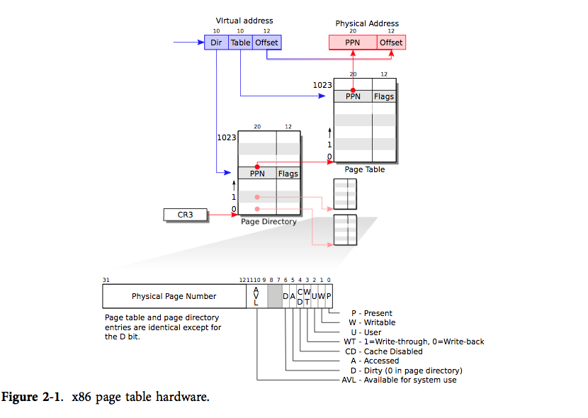

# 页表

x86 页表是一个包含2^20的条页表条目的数组。每条PTE包含一个20位的物理地址和一些标志位。分页硬件通过高20位来找到虚拟地址在页表中的索引，然后将高20位置替换为PTE的PPN，低12位是会被分页硬件原样复制。因此在虚拟地址-物理地址的翻译机制下，页表可以为操作系统提供大小为4KB的内存片，

# 页表缺页

内核只是在进程的虚拟地址空间中寻找出一段空间的虚拟内存区域vma然后分配给本次映射

## 缺页中断的原因

- 因为只进行了映射，未与真是的物理内存发生关联，所以此时进程页表中与mmap映射的虚拟内存相关的各级页目录和页表项都为空
- 虚拟内存进行过映射，其在进程页表中也都有对应的页目录项和页表项，但是其对应的物理内存被swap out到磁盘上
- 虚拟内存虽然背后映射着物理内存，但是对于物理内存的访问权限不足，如尝试去写一个只读的物理页

## 缺页中断的处理流程

- 当进程真正访问到这段虚拟地址的时候，才会分配物理内存，最后将引起本次缺页的虚拟地址在进程页表中对应的全局页目录项pgd，中间页目录pmd，页表项pte都创建好，然后在pte中将虚拟内存地址和物理内存